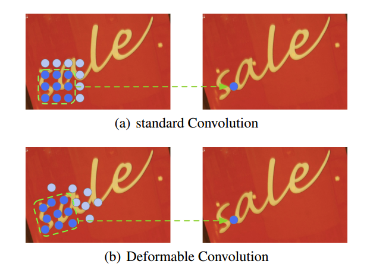

---
title: InceptText,A New Inception-Text Module with Deformable PSROI Pooling for Multi-Oriented Scene Text Detection
layout: post
date: 2018-05-04
categories: 
- paper_reading
tag: paper
blog: true
start: true
author: karl
description: Scene Text Detection
header:
   image_fullwidth: "../downloads/incepttext/1.png"
---  

InceptText主要提出了基于FCIS[^1]改进的场景文字检测算法，目的是为了解决任意方向文字检测的问题。文章提出了Deformable PSROI和Inception Module with Deformable Convolution结构来
应对任意方向文字检测问题。

## 网络结构 
- 特征融合解决小目标  
- Inception Text Module获取可变性感受野  
- Deformable PSROI获取可变性敏感ROI  

文章提出的网络结构下图所示：  

文章使用FCN分割的基本结构，底层backbone为ResNet，为了很好的分割小目标和大目标，文章将底层stage3用来负责小目标，stage5负责大目标。同时为了避免stage5中的信息丢失严重问题，在stage5中丢弃pooling方式，转而使用hole算法来提升感受野，同时可以维持较高的分辨率。以此应对常见网络中pooling带来的像素丢失导致的分割精度的下降。通过底层与高层信息的融合，模型在分割head部分得到两个分支，而为了使得两个分支对小目标均有有好处，文章通过将stage3阶段的特征分别与stage4，stage5进行上采样特征融合的方式弥补小目标信息。对于每一个分支的输入，模型首先通过Inception Text增加网络对任意方向的适应，加入带有deformable convolution的inception结构，具体如下图所示：  
  
与常见的Inception结构不同之处在于最后的特征融合部分加入deformable conv，相当于在inception结构对于长文本以及不规则矩形的特性上继续加入对倾斜文本的感受野，使得该处像素可以对应原图较为任意的文字区域。具体deformable conv的感受野效果如下图所示：  
   
在最后预测层，文章改进PSROI,加入Deformable的思想，在原有PSROI基础上加入全连接层学习可变性偏移delta x, delta y。具体如下所示：  
 
由图可以看到Deformable PSROI得到的roi为可变性的，这样对于任意方向的文字具有一定的好处。  

