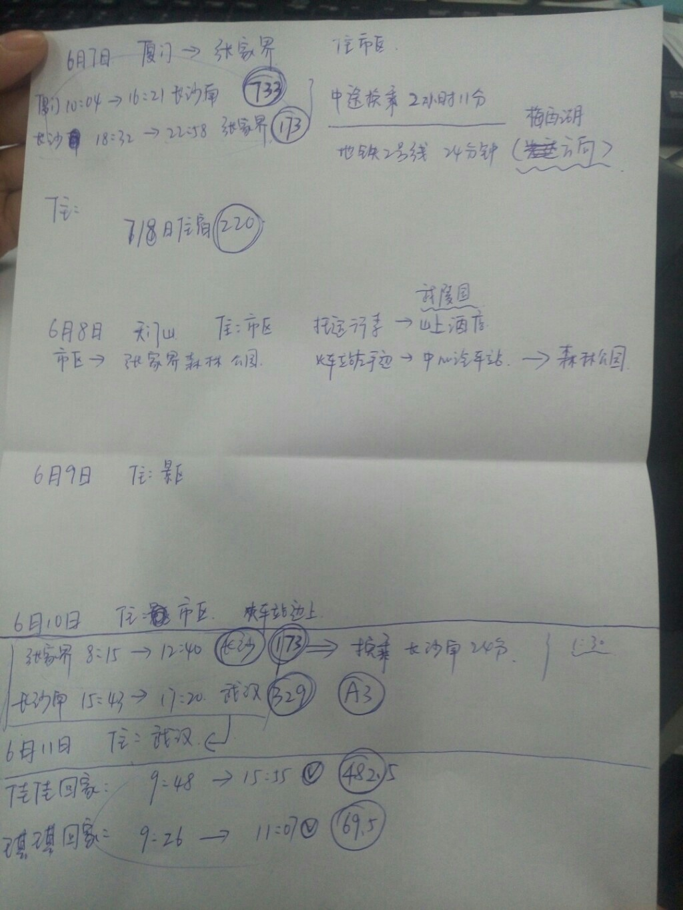

---
title: 告别学生时代的旅行——张家界
layout: post
date: 2018-06-25
categories: 
- life
tag: travel
blog: true
start: true
author: karl
description: Scene Text Detection
header:
   image_fullwidth: "../downloads/zzj/1.jpg"

feature: /downloads/zzj/1.jpg
---  

## 前言  
眨眼已经离开校园将近大半个月，而在最后的时光中，也算弥补了之前毕业旅行的缺失，细细想来，造化弄人。丢了美团，来了京东；没去成都，却和某人去了张家界。回想起来，顺其自然确实没错。

## 出发前的故事  

张家界是一直计划去玩一下的，计划着跟舍友，跟着同学一起去；谁想中间的一些有趣的事情鬼使神差，使得最后竟然变成了我们的二人行，之前一起计划的舍友因为西藏之旅疲惫不堪，在宿舍修身养性而另外的同伴因为别的旅程而退出计划。眼睁睁的看着张家界的旅程快要泡汤，某人拍案而起：老哥，咱们要不去张家界吧！着实让我惊奇了一番，好啊。于是接下来的几天一直在做攻略。然而在攻略的那几天，一度想着去武夷山玩耍，想想还好最后坚持了下来，不然在武夷山一脸懵。  

先贴一下我到底参考了什么样的攻略，首选知乎：[张家界攻略分享](https://zhuanlan.zhihu.com/p/21831382)，[张家界旅游攻略](https://zhuanlan.zhihu.com/p/32533464)。别人的攻略终究说个大概，细说至timing，并不细致。于是在我做了大致的经典功课之后，在一个吃完晚饭的实验室的倒数第二晚，某人坚持要做细致的攻略，从火车票到住宿，接着是经典的排期，可谓细致入微，一旁的我看着认真的某人，心里暖暖的。于是在那晚7点开始，到9点的时间段里，参考了airbnb，12306等，做出了如下归期。  

  

接下来就详细的按照上图讲讲路上的故事。  

## 厦门到长沙  
6.7清晨出发，太阳不算很大，在吃早饭的时候，接到欧阳的电话，让我去帮拿一下公交卡，但那是时间比较急，所以
告诉他身上有硬币。于是木有帮忙回去拿。某人去超市买了她的怡宝和我的农夫山泉，便往校门走去。路上碰到返回来的欧阳，
要说还是妹子说服力大，某人一通说服，欧阳跟着我们去了厦门北站，算是毕业最后的送别，到达公交卡给了欧阳，我俩进了站。于是开启了厦门到长沙的旅程。

这趟高铁抵达长沙时间是下午4点多，所以路途比较远，一路准备了电影和零食，当然最多的还是聊天。列车在福建境内走了大部分的旅程，其实福建省的山还是比较多的，然而三年间没有去观赏它，曾经与发哥约定的云水谣，也因为最后的疲惫取消。列车经过武夷山东的时候，还和某人说着武夷山美，透过玻璃可以看到山腰的山岚，山有木兮也有枝。铁路两旁的小山村给人以安静，悠闲的感觉。此时某人有所憧憬，如果将来养老，来这样的地方肯定很舒服。那肯定很舒服啊～列车在穿过福建一道道山后，进入江西，此时书包里的零食有味道的被吃掉一半，而某人也觉得我话比较多，让我歇一歇。于是看起了综艺，不时的扫窗外一眼，可能是碰上雨天，窗外都是云雾缭绕，如入仙境，懒散的躺着，看着综艺，窗外雨珠猛猛的拍在窗户上，接着是晴天，又是雨天。对了，出太阳的时候，在列车上看到了彩虹，发现跟着某人已经看到两次彩虹了，彩虹总在阳雨后。  

看着看着，稍感疲倦，距离长沙还有一个多小时，于是略作姿势调整，小憩一会。  
抵达长沙后，乘坐地铁换乘至长沙站，换乘过程中发现长沙比厦门就是少了“经济特区这四个字”，这座城市不着急，路上人们优哉游哉的。而地铁也十分调皮，有各种的周边装扮：电台，网易云音乐等。换乘至长沙站，吃了盖浇饭，可以说那么一盘辣椒炒肉吊人胃口，量也很足。算是非常满足某人了。接着便是从长沙到张家界的旅程了，之前还计划在长沙呆一晚第二天换乘去张家界，现在想来，实为明智之举。