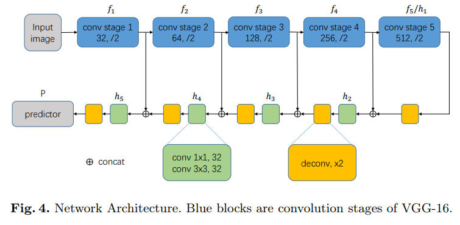

---
title: TextSnake, A Flexible Representation for Detecting Text of Arbitrary Shapes
layout: post
date: 2018-07-09
categories: 
- paper_reading
tag: paper
blog: true
start: true
author: karl
description: Scene Text Detection
header:
   image_fullwidth: "../downloads/textsnake/1.png"
feature: ../downloads/textsnake/1.png
---  

## 前言  
对于场景文字检测来说，主流路线可以大致分为基于检测和基于分割的方法。其中基于检测方法，如R2CNN，RRPN，SSD系列的TextBoxes，CTPN等方法；对于基于分割的方法，如DDR，EAST基于分割为基础的回归方法，当然还有一股清理，纯基于分割的方法，但多为实例分割，实现文字区域的较好分割，代表Piexllink,incepttext等方法。其中基于分割的方法其优势在于对形变文本、扭曲文本可以作出很好的描述，即分割结果可以是任意形状。但是由于标签的存在形式为RBOX，QBOX或者bbox,导致在最后的文字检测结果中只能以以上形式出现，进而导致对扭曲文本的检测难以达到较好的结果。  

## IDEA  

TextSnake的思想与Seglink的思想类似，即将文本区域进行切割，得到较小的文字实例，分别对其进行回归，然后通过特定的后处理实现整个文本区域的检测。具体的文字区域的表示方式如下图所示：  

  

上图将文字区域分为两部分的组合表示：text region， text center line。而以上的tcl的构造论文中有详细描述。而利用tcl可以得到一系列的disks，即图中一个个圆，一个个圆覆盖的外接区域就是对应的文本区域。    

## Method  

整个算法pipeline如下图所示：  

  
可以看到的是，对于输入图片，首先经过一个U-Net得到TR，TCL区域的分割结果，后经过两者的结合得到真正的文本中心线区域，后利用并查集算法，得到每个文本实例的分割结果，然后利用后处理方法，得到完整的文本区域。  

### 网络结构  
网络结构图如下图所示：  
  
网络结构为Unet，backbone为VGG16，此处是为了与常见方法的比较，可以使用更为强劲的ResNet。在decoder阶段，使用拼接，然后接1x1,3x3做通道整合，特征提取。  

### post-processing  
后处理大致流程可以如下图所示：  
  
首先利用得到TCL分割区域结果，随机选取切线与垂线得到与TCL区域外边和内边的交点，去两个交点之间的中点为在tcl上第一个disk的圆心所在，接在以圆心为起点，以于圆心所在交线垂直的方向进行探索，得到下一个圆心，如果期间出现圆心掉在TCL区域外，在缩小距离。一次类推，得到整个tcl上的disk轨迹，进而得出中心线的轨迹。而具体的搜索方法如下图所示：  
  
是不是很巧妙~  

### label generation  
label generation 的pipeline可以如下图所示：  

  

首先找到最左边和最右边的两条边，作为整个文本区域标签的头尾，然后将边进行距离切分，并找到切割线的中心，作为圆心，圆心到边的距离作为圆的半径，进而得到tcl的标签，其实这块有点迷糊，等代码公开后自己研究一下。  

### loss function  

目标函数如下图所示：  
  

分为分类损失函数以及回归损失函数，其中分类为分割的损失函数，回归为分割结果map中的每个像素位置上的回归信息，包括半径r,cos和sin，用于后续tcl的计算，这里回归形式使用的smoothedL1，目的是为了对小的变化不敏感，对较大的回归变化进行压缩，详细可以参看smoothedL1形式。  

### benchmarks  

数据集合使用SynthText合成数据，TotalText最新放出的扭曲多方向文本数据集，CTW1500同样的扭曲文本数据集，ICDAR2015比较经典的文字检测数据集，MSRA-TD500同样的，多语言，多方向，长行文本。  

### 实验结果  

结果如下图所示：  

  
可以看到第三张图，检测结果为扭曲的检测结果。  

作者在各个数据集上对比了不同的方法，如Total text结果如下所示：  
  

由于数据集中存在扭曲文本较多，因此Textsnake表现出较好的性能，原因在于Seglink和EAST的标签形式只针对多方向，对扭曲文本并不具备完整检测能力。  
同样的对CTW数据集，结果如下图所示：  
  

然而，在数据集icdar2015上，结果如下图所示：  
  

pixellink为最好的结果，原因在于其为纯分割的网络结构，没有回归。同时对于密集文本具有较好的检测性能，较小的字体同样。

## 小结  

还有几天就入职了，准备做OCR相关的任务，虽然blog写的不怎么样， 权当做记录，希望对小伙伴的有所帮助。下一篇博客就是工作后的内容啦！