---
title: "张家界travling"
layout: post
date: 2018-06-25
tag: life
blog: false
project: true
star: false
author: karl
category: life
description: 张家界
---  
## 前言  

由于离校后不计划返校，因此身上携带的是回家的行李，so，对于张家界的游玩路线，需要寻找合适民宿，尽可能减少行李的携带。那么就从衣食住行开始介绍这次旅行，当然也会夹杂途中内心的想法。 Let's go!  

### 游玩路线  

张家界主要分为如下几部分游玩景点：天门山，张家界森林公园，张家界大峡谷景区。而我们选择前两个景点进行游玩。行程如下，第一天天门山景区，第二天，第三天在张家界森林公园，当天返回张家界市区，次日回家。如此安排的原因在于，张家界森林公园较大，一天无法完整游玩，且天门山位于市区，对于第一天居住市区的我们是绝佳的游玩景点。  

对于天门山景区，就是一把梭。上山按照地图绕一圈即可，风景全在山顶，除了那个999台阶的天门洞。坐市区大巴车抵达山腰停车场，抬头便是天门洞，此时会有很多人疯狂的拍照，具体场景如下图所示：  
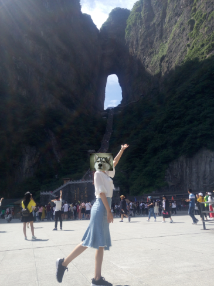  

你会在这里花费很长的时间，只为拍一张很nice，背景板不那么密集人头的，兼具天门洞以及台阶的靓照，差不多40多分钟吧，拍好就准备一个台阶一个台阶的攀登，会很累，但可以走走停停，感受山间的风，坐在台阶旁边的石凳上歇歇脚，看看争执攀登的人气喘吁吁的样子，吃吃好吃的，减轻下背包的重量，重振旗鼓，继续攀爬。估计歇息三四次，就到山洞位置了，这时候会有种“初极狭，才通人，复行数十步，豁然开朗”，看到这张图：  
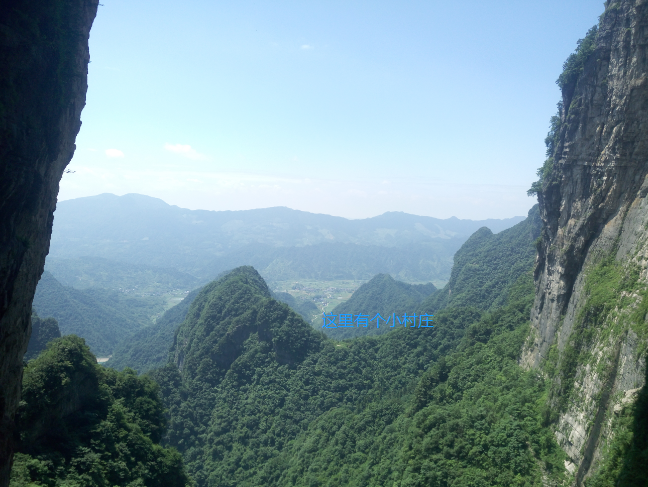   

可以看到左右两边的石壁，像不像一刀切，山很奇特，与天门洞一起联想不由得认为古代仙人在此修道，山顶凡人无法抵达。手机比较渣，无法完美呈现当时的feel，从此处出发，乘坐上山的扶梯抵达山顶，扶梯就木有照片了，要注意安全站稳扶好。抵达山顶后，当前位置是山顶的游客中心，然后顺着路绕山顶一圈抵达下山索道口就好。以下是一些沿途拍的图：  

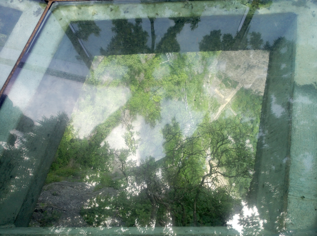  
玻璃栈道，估计是玻璃栈道比较窄，而且人比较多，因此没有那种很害怕的感觉，走走就好。山顶有两处玻璃栈道，需要戴脚套。一说脚套就想起被山脚大妈戏耍智商的经历，说山顶脚套收钱，买了就不需要再花钱。然而，5块钱是脚套加栈道的钱，算是旅途中的一个小插曲吧。  

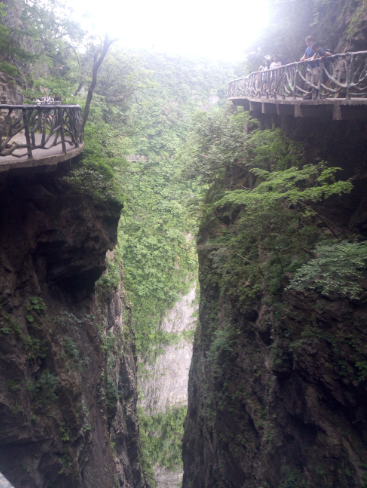  
上图为途中的山间栈道，窄窄的，溜溜腿，透心凉的感觉。  

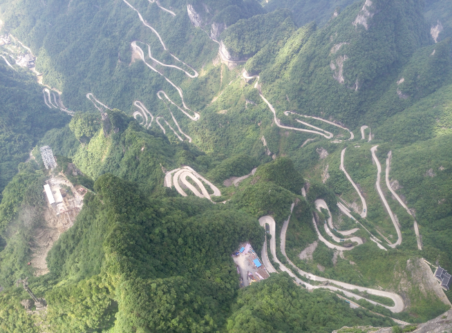  
在某栈道旁排到的山下俯视图，山路十八弯，上山做的巴士可以体会到有多难。  

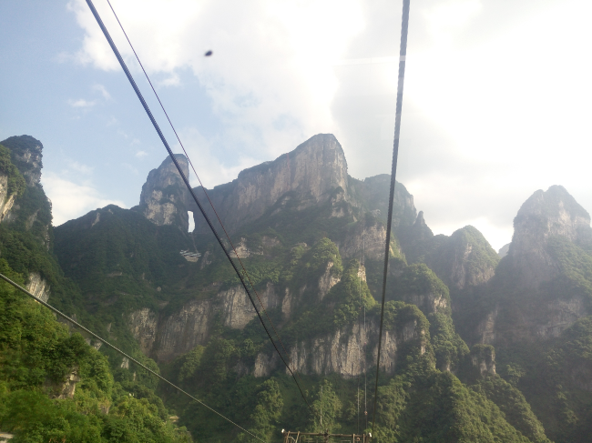  
下山索道回头望山全景，天门山值得一去，山很美，很险，很漂亮。  

对于张家界森林公园，这里只记录两天的行程，图片无法描述其的秀丽。第一天抵达武陵源门票站，和某人开启第一天的行程。Day1，山下主线，金鞭溪-黄石寨-杨家界门票站。一下午溜达了别人两个小时玩完的金鞭溪，一路会看到千里相会，神鹰护鞭，以及一些极具富有想象力的山的命名，会惊叹山为什么可以这样，到底是如何形成的。一路还会路过三打白骨精的取景地，听听导游讲故事就可以噘着嘴离开了，当然沿途会遇到本地的导游，他们会强行跟着你，为你带路，介绍景点，以此来赚点小钱。各取所需，只要心里不排斥就好。金鞭溪出来，准备去黄石寨，索道上下，当时上山后时间比较赶，没有很好的慢慢游玩，和某人在黄石寨观景台取了一下景，感受一下：  

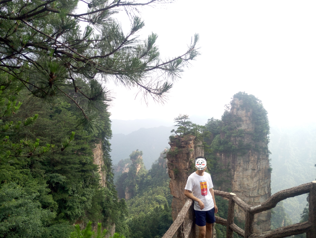  
如果是雨天的话，应该会很美吧。  

黄石寨下来，准备前往景区的民宿住处，老板很有意思，第一次被金毛咬，金毛很聪明，民宿家常菜很合胃口，山中晚上很安静，伴随晚上蛐蛐的叫声很容易入睡。 接下来就是开启新的一天山上路线。  

山上路线：：杨家界-袁家界-天子山-回市区。  
杨家界缆车上山，景点之间摆渡车摆渡，天子山下车，直接上图吧，文字太苍白。  

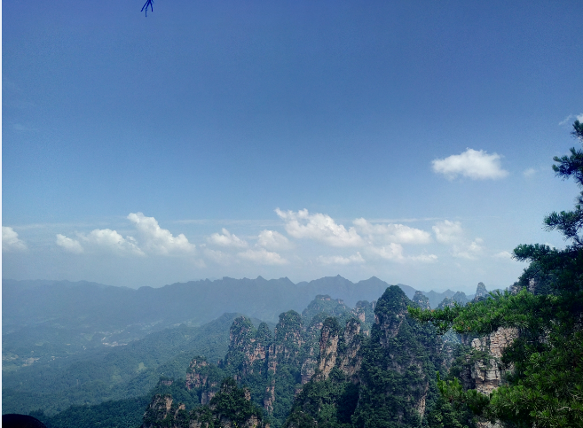  
杨家界天波府看到的风景，天波府值得一去，高，窄，爬上去费力，但是会觉得有意思，怕铁索梯子到达顶部。  

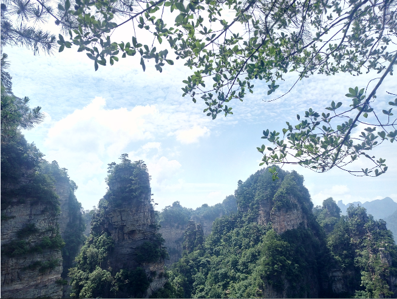  
从天波府下来时候拍到的杨家界山的景色，山像从天而降的柱子插在地上，很惊奇。  

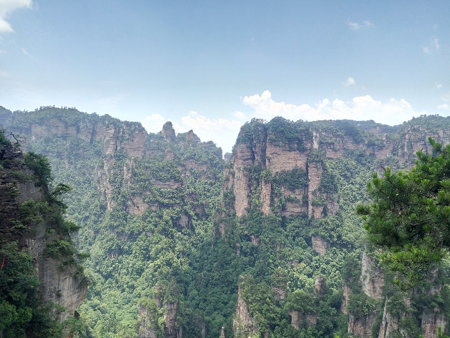  

这是袁家界拍的，袁家界有阿凡达哈利路亚山的取景地，本人认为阿凡达因为取了这些景而让电影活起来，并不是电影使得这些山出名。  

最后的天子山名不副实，只是远远的拍了天子阁，便坐索道下山了。  

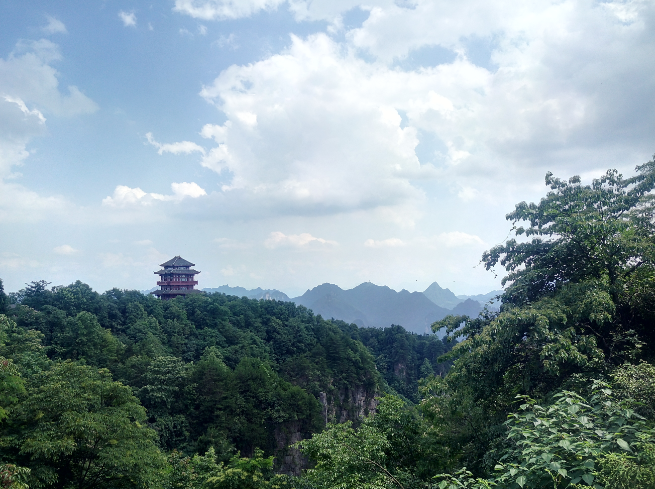  

天子阁里有玄机，当看完所谓的苗族文化之后，便跟着某人出了天子阁，毕竟no free lunch~  

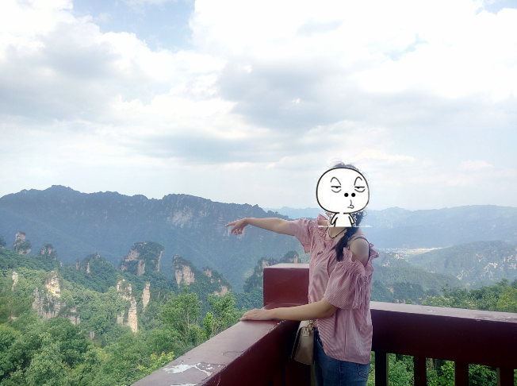  

某人在天子阁上指着仙女献花的调皮样子。  

索道下山，找到了对应的大巴车，坐着回了市区，结束了整个旅程。  

### 住宿和吃 

张家界市区的很多民宿可以负责森林公园和景区之间的行李托运，但是最好是寻找比较在景区和市区都有民宿的住宿，这样可以省去行李的托运，爱彼迎上张家界民宿可以了解一下。  

对于吃，和某人向民宿老板咨询了附近的好吃的地方，湘菜味道比较可口，所以张家界市区的吃的也差不了，当地有三下锅，毕竟太油了，所以没有吃。吃了两天比较下饭的吃的，菜菜菜，辣椒辣椒辣椒，还有米饭米饭米饭。至于更好吃的东西，需要自己深入可以吃的地方去挖掘喜欢的饭菜。最后贴一下某人做的出行timing：  

  

## 体会  

张家界攻略我认为还是做了的，虽然某人认为没怎么做，当然完全是她的功劳。肯定她的话就不多说了，张家界很好玩，但是有某人在更好玩，一路看的不是风景，有她的地方才是风景。

