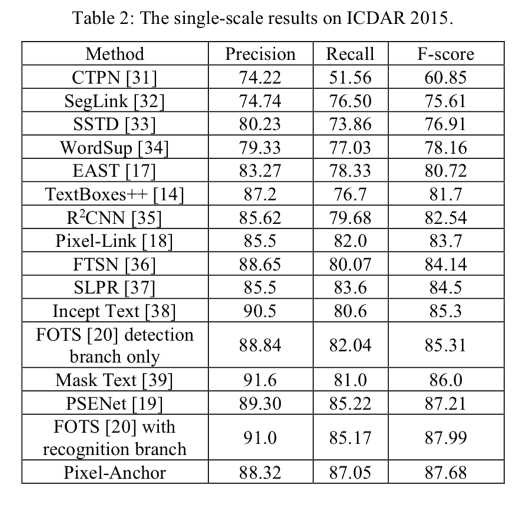

---
title: Pixle-Anchor,TextBoxes++与EAST的结合
layout: post
date: 2018-11-21
categories: 
- paper_reading
tag: paper
blog: true
start: true
author: karl
description: Scene Text Detection
header:
   image_fullwidth: "../downloads/pa/1.png"
---  

## 前言
pixel-anchor是云从科技昨天放出来的论文，文章提出了east和Textboxes++的合体模型，通过结合anchor-based和pixel-based的检测方法的特性，达到了SOTA。不过就整个框架而言，创新点虽然不多，但是预感会带起一波检测与分割结合的文字检测方法。

## 文章脉络
- anchor-based和pixel-based方法的优缺点
- 网络结构
- 结果分析
- 模型分析

### anchor-based和pixel-based的检测方法  
anchor-based的方法可以分为两个派系，一类是faster-rcnn,另外一类是SSD系列。  
其中，基于faster-rcnn的方法具体代表有如下方法：
- RRPN：提出带角度的anchor,设计的anchor需要足够多的角度以及尺度覆盖场景中的文本,但是为了覆盖所有的文本尺度变化以及角度，需要人工设计较多的尺度；
- R2CNN：提出不同感受野的roipooling:7x7,3x11, 11x3用来检测多角度的文本
- CTPN：更改RPN anchor为水平方向的序列anchor,利用后处理将anchor连接成行
- InceptText：基于FCIS，加入Deformble conv和deformable PSROIpooing回去较强的感受野，同时加入inception module获取丰富感受野，检测文字
- FTSN：InceptText的平民版本
- etc  

而基于SSD的方法具体代表如下：
- TextBoxes and TextBoxes++：基于SSD,更改多尺度层中国的anchor尺度，并加入对倾斜框支持
- SegLink：基于SSD，将文本分为segments和Links，多尺度预测segments和link，利用后处理方法连接成文本
- etc  

这类方法主要依赖anchor的选取，因为文本的尺度变化剧烈，使得此类方法anchor的数量较多，进而效率较低。同时由于anchor的匹配机制，每次针对roi区域生成一系列的anchor,筛选合适的anchor最为胜负样本的标签，在预测阶段由于proposals很多，使得recall通常较高；但是，对于较长而且密集的文本行而言，此时的anchor宽高比可能高于10,甚至更高，不但网络需要更大的感受野，同时需要配合较大宽高比的anchor，此时基于anchor的检测方法需要精心设计，使得anchor尽可能的覆盖所有的文本尺度。

对比Pixel-based的方法，如：
- pixellink：基于FCN分割网络，加入对pixel score Map的预测和当前像素与周围像素link的预测，后处理获得文本实例
- sotd：纯分割网络，加入border，用来分割密集文本。后处理通过minAreaRect获得检测框
- PSENet：FPN,预测不同大小的kernel,通过扩张算法得到各自的文本实例
- EAST：resnet50-based Unet，加入geo_map和score_map的预测，最后通过每个像素预测框Nms得到最后的预测框
- DDR：EAST的孪生版本
- FOTS：基于EAST改进，加入OHEM, ROIRotate以及识别分支
- etc  

通常为分割+回归，或者单独的分割接后处理的形式。这类方法基础网络多为Unet或者FPN，因此对小目标分割具有一定的优势，但是其回归的方式多依赖网络的感受野：如east，DDR， FOTS。虽然通过一些样本挖掘的方法可以获得一定的提升，但是感受野不足导致此类模型在回归较长文本或者较大文本时，容易出现检测不全或者丢失的情况。

上述是三种方法的回归方式可以用下图表示：  
  
其中pixel-based的回归方法，回归时每个像素点预测到四条边或者四个角点的绝对距离，这类方法，当文本较长或者较大时，如果网络感受野不够充足，会导致预测的值不能到到达文本的边界，出现文本框断裂的情况；而Link regression的方法，典型代表为PSENet,pixellink等方法，此类方法对感受野依赖较小，因为关注的是像素与其周围像素的从属关系。如pixellink，除了对当前像素预测其属于文本还是非文本，同时会预测其与周围8个像素的连接关系，如果存在连接，则输入同一个文本实例。但是此类方法依赖的一点为分割结果图的准确性。如果分割不够精准，容易出现像素逐渐的引入周围的噪声，出现错误的预测结果。同时，对于文本区域较为稀疏的情况，此类方法难以实用，因为文本间隙的背景信息，在训练过程中为噪声信息，当背景信息足够多，或者上下文信息迫使网络将其预测为背景，就会出现文本无法被检测出来的情况。典型的文字为大而镂空的文字。这也是多数文字检测算法无法将其完整检测的原因。

针对上述的检测方法的弱点，作者提出了anchor-based和pixel-based结合的方法，结合两种方法的优势，不仅在icdar2015上达到了SOTA,同时对长行的中文检测场景有较好的适应性。  

### 网络结构  
网络结构可以分为两部分，其中pixel-based的方法为对EAST的改进，anchor-based的方法为对SSD的改进。前者主要为了检测中等的文本，后者主要为了检测长行和较小的文本。
#### 针对EAST的改进  
网络结构如下图所示：  
  

针对EAST的改进，文章延续FOTS对EAST的改进，加入以下插件：  
- ASPP
- OHEM:针对分类和回归  

ASPP来自deeplab中，其主要作用是在不降低feature map分辨率的情况下，提升网络的感受野，即可以提升模型获取上下文信息的能力。它会带来什么效果呢？  
首先，是分割效果更为精准。分割一个物体，网络往往借助的是该物体周围的信息，比如，分割前景，我们需要找到背景信息；当感受野变大时，对于较长的文本或者较大的文本，可以很好的找到其边界，进而分割出较高质量的文本区域；其次，感受野的提升，会是的回归的距离变长。即geo_map中的值表示，当前像素到四条边的距离。而网络建立起当前像素与边界之间的距离关系。当上下文信息充足时，可以准确的建立起距离关系，进而边界预测足够精准。因此文章加入ASPP的作用主要是以上两点，分割精准+边界定位精准。  

OHEM常用来进行困难样本挖掘。对于文字区域的分割，存在样本的不平衡，文字区域往往占比比较小，背景占比比较大。同时，对于一张图中的多个文本，小的文本区域的损失往往被大文本区域损失覆盖；而且还有一种情况，背景中存在难以区分的样本，这些背景容易导致模型将类似的文本区域分为背景。因此加入OHEM,可以对这部分背景信息进行挖掘，同时在训练过程中正负样本进行均衡，避免了类别不均衡的问题。  

以上就是该文章对EAST部分的改进。其实OHEM来自FOTS对EAST的改进，ASPP在此之前已经尝试过，确实会带来边界预测的提升。  

对于这部分EAST，除了预测以往的文本区域的score_map和geo_map, 同时预测一张attention map用于对anchor-based分支的信息的辅助。

#### 针对Textboxes++的改进  
网络结构如下图所示：  

文章在EAST的基础上，加入了anchor-based检测分支，主要针对文字尺度以及宽高比较大的变化，文章对SSD进行了定制。如上面右图所示。文章主要利用来自ResNet50中的1/4和1/16的feature map：  

对于1/4的map，由于其处于底层，因此具有一定的分辨率，对于检测较小的文字具有一定优势。同时由于此处的特征语义信息较弱，文章将east分支得到的attention map用在此处，主要为了对该层加入一定的语义信息。具体操作为，对来自east的attention map输出进行exp激活，然后与1/4 feature map进行对应位置的加权。这么做的好处是，对1/4feature map上的信息，属于文本的像素进行加强，对于不属于文本的像素进行抑制，突出文本信息。文章说，这么做可以很大程度的减少错误检测。这里需要解释下为什么anchor-based的方法检测小目标会出现较高的fp.原因在于，在较高分辨率的feature map上生成proposals时，由于像素点比较多，目标较小，因此整张图中网格都处于负样本区域，极少数网格落在正样本区域。这样在预测是，负样本较正样本多，而且负样本的方差较大，因此容易导致分类的错误，因此容易出现fp.  

对于1/16的map，文章进一步的进行特征提取，一是为了获得更大的感受野，二是为了获得多尺度的信息。分别为1/32. 1/64, 1/64, 1/64。但是为了避免出现很小的feature map,文章在后面的feature map保持在1/64。但为了继续提升感受野，文章在后面两个尺度的的生成时，加入了空洞卷积，在分辨率不减小的情况下，获得较大感受野。对于每一层的feature map,文章在其后加入APL层，层中内容如上图右图中的左半部分所示，分别为不同的卷积核搭配不同的宽高比，实现对不同尺度，不同角度的文本的cover.如3x3为方框，3x5主要为了检测水平倾斜的文字，5x3为了检测垂直倾斜的文字。1xn,nx1主要为了检测水平和竖排长行的文字。可以看到有夸张的1:35,35:1的宽高比，这在中文场景是很常见的。  

在经过以上APL层之后，将得到的proposal进行拼接，预测最终搞得四边形区域。  

此外，文章为了检测密集文本，加入了anchor density,如下图所示：

  

对于每个anchor,进行一定的位置的偏移，是的对于密集的文本来说，可以获得理想的proposals.   

#### 关于后处理  

在预测阶段，文章采用fusion NMS的方法：用anchor-based的方法对小文本和长文本进行检测，pixel—based的方法用来检测中等的文字。其实也算扬长避短。EAST的优势在于检测小文本和中等文本，对于长文本无力。而对于SSD，可以利用夸张的宽高比检测这些难以检测的文字。对于1/4 map上的anchors和其他mao上的长anchors都会被保留，因为1/4上的anchors足够cover小文本，而对于长文本，或者大角度的文本，不具有检测能力。不会因为anchor的匹配机制筛掉挨得很近的框。而对于EAST预测分支，过滤掉小于10像素，以及宽高比不在[1:15, 15:1]的范围的文字。最后将这些box集合到一起，通过nms筛选得到最后的框。  

### 实验  

#### 数据增强  

文章中提出的loss分别为pixel-loss和anchor-loss,通过设置一定的比例进行调整对模型的贡献。在训练过程中，文章从原图中随机crop 640x640大小的的图片区域输入至网络中进行训练。然后模型首先在SynthText上进行与训练，然后在此基础上对各组实验进行微调。  

文章针对小文本、长文本、大角度文本分别作了实验，证明该算法的有效性。下面是效果图：  

  

可以看到，图中的长文本、小文本检测较为良好，这都归功于ASPP和大的宽高比的anchors和卷积。  

以下是在ICDAR2015上的实验结果：  

    

文章老早就在git上宣传，现在看来效果还是很不错的，单尺度达到了SOTA。  

在多语言ICDAR2017 MLT上，同样的结果：

    

#### 分析  

文章结合了anchor-based和pixel-based的方法的优点，扬长避短，一定程度上解决了长行，小文本以及倾斜文本的检测。但是anchor-based的分支依赖较强的手工设定anchor,因此对于长行还是存在一定的局限，但是在实际应用过程中还是很实用的。 

## 疑问  

待续。。。。

