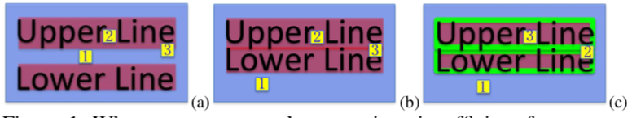
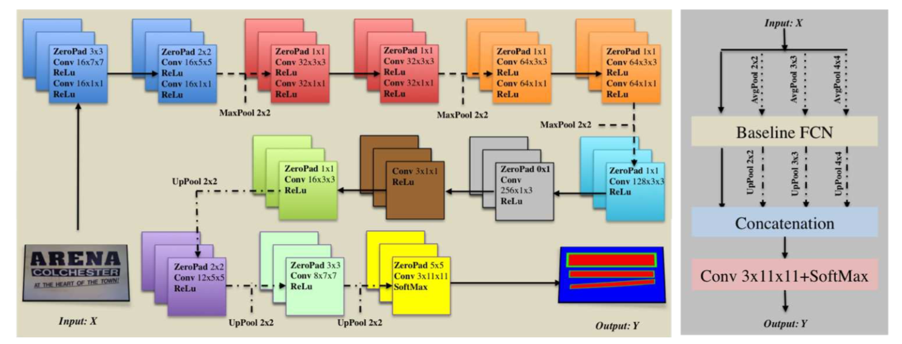
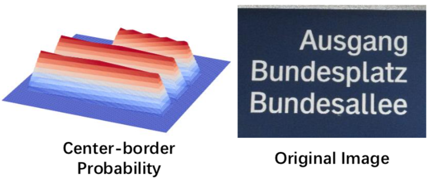
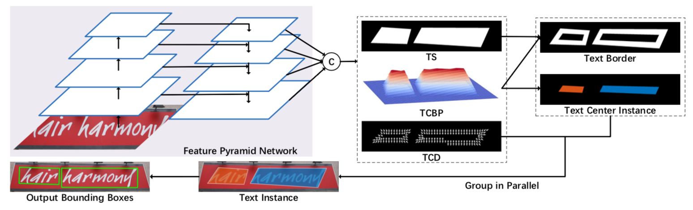
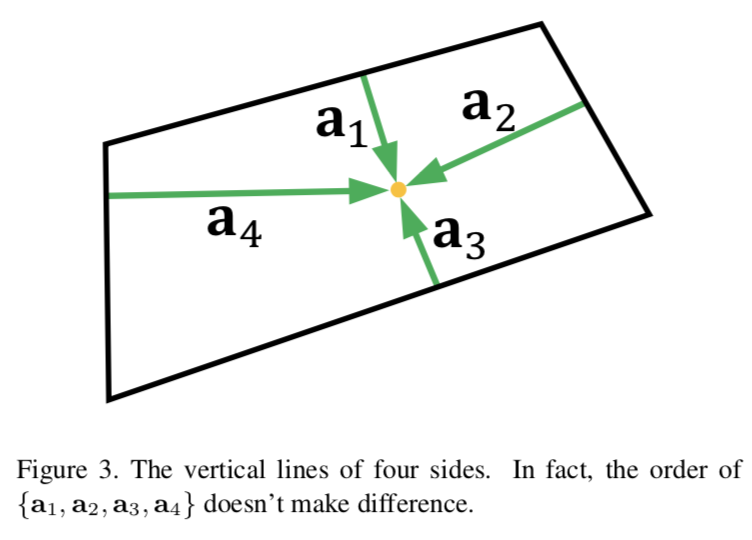
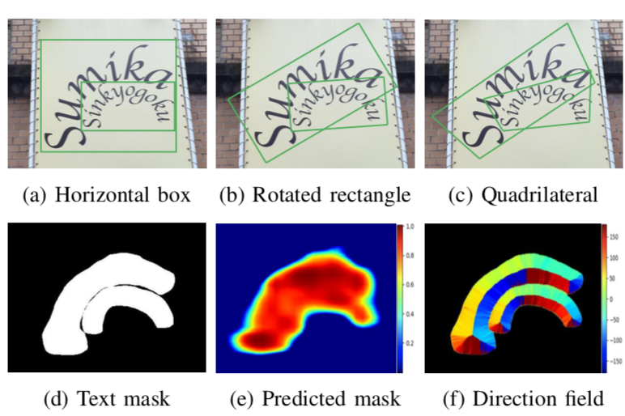
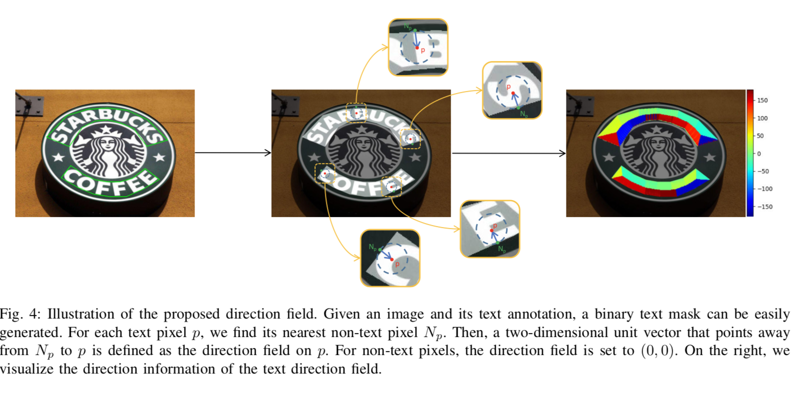
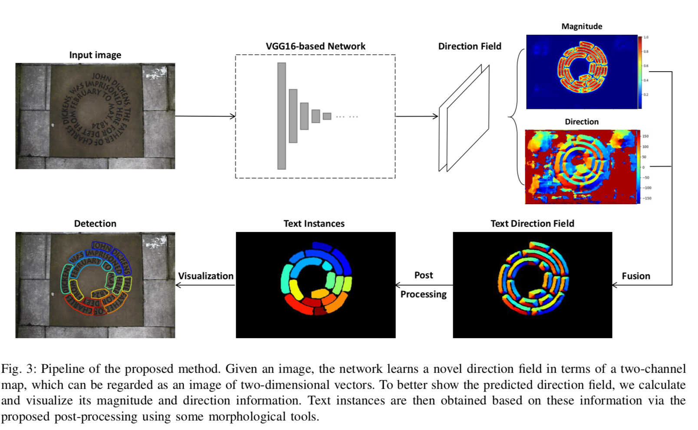
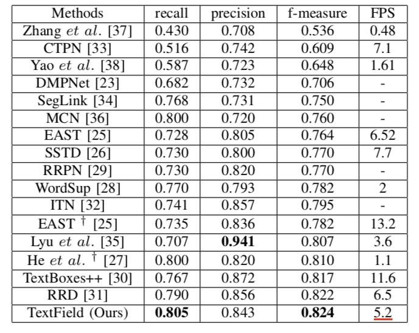
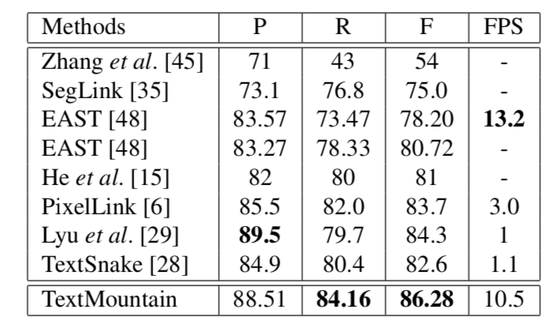

---
title: 场景文字检测中边界的艺术(上)
layout: post
date: 2018-12-15
categories: 
- paper_reading
tag: paper
blog: true
start: true
author: karl
description: Scene Text Detection
header:
   image_fullwidth: "../downloads/tm/1.png"
feature: "../downloads/tm/headbg.png"
---  

## 前言  
对于曲形文本，使用regression-based的方法很难完美的做到边界的定位，因此最近对于曲形文本的检测逐渐转向了文本区域分割+边界校准的方式解决，典型代表，TextMoutain,  TextField,当然这里也可以顺带讲一下边界最初的使用者——SOTD。估计没有它，就没有后续一系列经典的对于Border learning的改进。  

## 本文一览  

本文不主要讲解论文，主要分析各类基于分割的文字检测中对边界学习的改进，以及他们的作用，主要集中于以下几个方法：  
- SOTD
- TextField
- TextMoutain   

## Border learning  

最初border learning的提出，主要为了解决密集文本的检测，如下图所示：  
  

对于密集文字来说，由于两个文本之间间距较小，间隙中背景信息较少，因此具备较少的语义将其分开，进而直接使用分割，容易导致出现文本粘连的情况，如上图(b)所示。因此，各路大神认为，对于行文本来说，处于文本边界的像素属于歧义样本：即包含背景信息较多，但同时属于文本区域，不利于文本区域的分割。因此，类似于EAST或者DDR中，将文本区域进行shrink，丢弃边界区域，防止其对分割任务造成影响。同时防止密集文本的检测结果粘连。然而，不同于EAST，DDR这类分割和回归的混合方法，纯分割的方法使用shrink后的文字区域作为文字区域，那么从分割结果得到文字的边界无疑是一种经验方法，即通过构造label时的shrink比例，把分割区域进行放缩，得到最后的文本区域或者检测框。因此，针对上述经验的工作，SOTD没有将边界信息丢弃，反而将其作为第三类，相当于文字与文字之间的墙壁，将密集文本隔开。同时变相的增加了训练样本。具体图图(c)所示。  

### SOTD  

该方法的全称叫做Self-organized Text Detection with Minimal Post-processing via Border Learning。文章的主要思路在于，将文字区域的边界像素作为第三类border类进行学习，在训练过程中直接使用互斥的三分类，解决密集文本粘连的问题，同时针对任意形状的文字具有一定的检测作用，这里为什么说一定的检测作用呢，因为其网络结构把多方向这条路给封死了，不信，可以看下图：  
  
文中主要针对PPT的简单场景，因此没有使用复杂的网络，少量的通道，以及最后的1x3的卷积，直接将文本的检测限制在文本行，因此文章对于行文本检测较强。同时文章暴力的加入多尺度训练，多尺度特征融合，提升分割的性能。  

但是，这种简单的将边界作为第三类进行分类的方法，有的文章认为不合适，这就是TextMoutain中所描述的。  

### TextMoutain  

TextMoutain认为，暴力的将文字分为边界和文字区域是不合适的，因为边界和文字区域不是完全分开的，应该是光滑的变化，如下图所示：  

  

文章将文字视为一座山，文字中心为山顶，边界处于山脚。这样从边界向山顶爬的过程，就是一个文本区域生成的过程。先上网络结构：  

  

文章使用FPN作为特征提取网络，后融合多层特征，进行分割。分割的输出有三种，TS为文字区域的评分，TCBP为文字Text center-border probability.通过概率图取阈值，得到对应的text border以及text center instance.网络的另外一个输出是TCD，即边界区域上像素指向文字中心的方向。最后，文章通过TCD中指向“山顶”的方向，从山脚开始向山顶爬，最后生成文字区域。label构造依赖下面一张图：  
    

图中a表示黄点到四条边的垂直距离。找出a1+a3和a2+a4中最短的作为构成Box的h,然后利用h。生成TS,TCD。  

#### TS的生成  
TS表示文字区域，但是其不是全1这种形式，而是一张平滑的map，其中每一像素值表示一个0到1的值，通过2*min({ai})/h得到，即如果黄点越处于文本中心区域，对应的值越大，反而越小。这样就出现了之前的文字的山一样的概率图。文章将其作为文字区域分割的真值。这样做，避免了border和文字区域的暴力分类，将边界和文字区域都认为是文本，只不过边界的像素概率低，而中心区域的文本概率高。  

#### TCD的生成  

TCD表示text center direction,也就是图中每一像素的值表示只想文本中心的方向，注意，这里只是方向，因此是一个单位向量，长度为1.文章是如何构造的这个标签的呢？  

$$ V_x = \sum_{i=1}^{4} [\frac{h_x}{2} - ||a_i||] * \frac{a_i}{||a_i||}$$  

如上面式子描述，计算每个ai和h的差值，值得大小代表了ai方向向量的大小以及正负方向，通过4个向量的求和，得到只想文本中心的方向。通俗点数哦，如果ai中某一个特别大，大于h,那么它的方向为此时a的反方向，因为h为中心所在，爬过了山头，需要折回去。在得到vx后，需要将其归一化得到单位向量，因为只需要知道方向即可。  

当然，在得到TS和TCD之后，便是爬山算法，利用TCD中的指向，对TS进行扩张，得到最后的文本区域。详细看论文中的后处理过程，非常巧妙。  

### TextField  

这篇文章和TextMoutain脚前脚后，一度认为他们的想法冲突了，仔细看并没，好吧，还是有一点点类似的。  
    
上图为文章对其标签后遭的描述，图中可以看出，直接基于文本区域的分割，容易带来粘连的问题，同时卷积对于扭曲文本的边界不能很好的分割开来，究其原因，曲形文本有时候文本边界在文本区域内部，这是无法通过直接的文字区域分割得到的。文章的标签一样的长得像moutain，但是构造的方式不同。接下来，简要说明下标签构造的路子：  

    

文章构造方向标签时候，文本区域的每一个像素，存放的值为当前像素与其最近的边界处像素构成的单位向量，指向文本区域。因此可以从图中看到，属于文本上方区域的颜色为一个颜色，下方为另外一张颜色，说明其方向一致。  

构造玩标签，就是整个模型的训练以及inference。如下图所示：

    

首先是通过网络分割得到文字区域和方向的mao，然后利用score过滤方向的map得到干净的文字方向的map，然后通过后处理方法，连接成完整的文字区域。这里涉及到搜索，详细阅读论文。  

### 性能分析  

TextMoutain在mlt上取得了SOTA，在ICDAR2015上0.86+,而反观TextField则效果较差，而且在ICDAR2015上性能hmean为0.82+, EAST可以到0.85。下面只列举在ICDAR2015上的结果：  

#### TextField on IC15  

      

#### TextMoutain on IC15  
    

这里TextField使用的VGG16,比较EAST, TextMoutain的实现用的resnet50较弱，所以存在一点的不公平。但是，可以知道的是，TextField的召回比TextMoutain较弱，一是骨干网络，另外一种可能是标签构造的不同。同样的Moutain算法，如果文本区域为moutain,那么与方向标签会很契合，进行再后处理中可以很顺利的grouping。在实际应用中，纯分割的网络分割多方向文本召回率很高，但是都存在边界定位不准的情况。因此，这两种方法的边界定位的准确性决定了这种方法的性能。可以看到的是，TextMoutain的性能更好，我想即使将Textfild的骨干网络换成resnet,应该也不会有夸张的7个点的提升。标签构造方式决定了后续的定位不准，Textfield使用的文本区域的点与离她它最近的非文本区域点的方向，当文本区域的像素处于边界的时候，容易出现该位置存储的向量的方向不稳定的情况，即极端情况，边界像素，存在多个距离最近的像素，因此边界标签不够强，出现后续的边界的向量预测不准，精度下降。对于TextMoutain,其border中存放的是指向文本中心区域的方向向量，不存在歧义的方向，因此在后处理过程中，可能存在文本中心与边界像素的交界处预测不准，其余是很准的，即便是处于文字边界的极端像素。这也是它性能好的原因。  

### 小结  

TextField， TextMoutain， pixellink，psenet等方法，实际上都是基于文字区域的分割然后加上对边界的校准，提升算法的性能。这种方法，也是基于检测、分割+回归在做的事情。同时，也可以看出，为了让算法检测出更为复杂的文本，边界的设计尤为重要。甚至在我看来，如果确定一个带方向的边界，便可以确定一个文本区域。border learning， the art of border!

