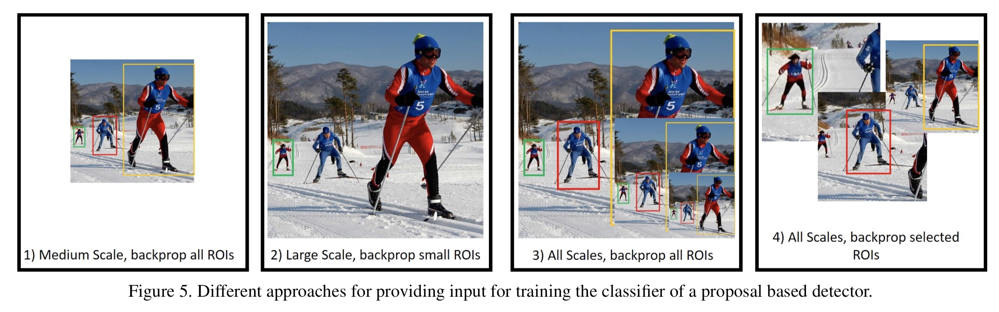
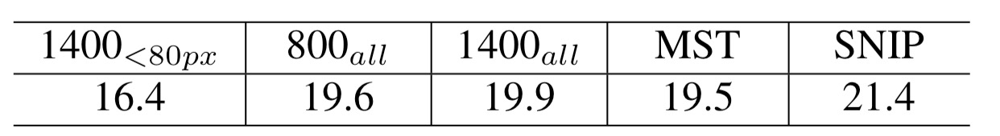
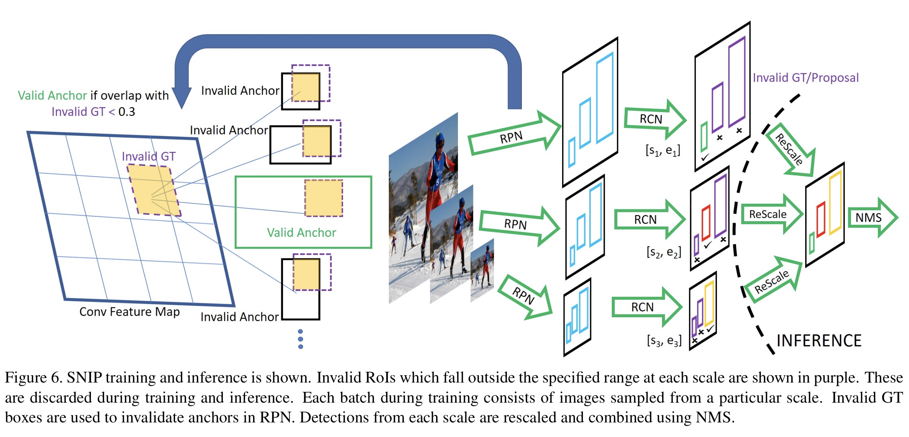

---
title: 目标检测中的尺度问题
layout: post
date: 2019-02-18
categories: 
- paper_reading
tag: paper
blog: true
start: true
author: karl
description: object Detection
--- 

## SNIP的做法  

### 尺度问题  
cv领域，往往涉及目标的尺度问题，而应对尺度问题，大家做了各种尝试。  

### 解决scale variation的方法
1. 融合高低层的特征检测小目标
2. dilated/deformable卷积增加感受野检测大目标
3. 不同feature map预测不同尺度的目标
4. 多尺度训练
5. 多尺度测试

### 文章提出的问题
1. 对于目标检测，上采样图片对于提升性能有必要么？  

常见图片尺寸为480x640, 为什么实际检测中常常将其上采样至800x1200?我们可以使用小的strides训练模型，然后在此基础上微调用作检测小目标么？

2. 当我们基于pretrained的分类模型微调检测器时，训练数据中目标的尺寸大小应该限制在一定范围(64x64, 256x256)还是使用所有的目标尺度(16x16~800x1000)?  

### 对比分析上采样的必要性  
首先，论文中对于224x224训练的模型，测试时分别将图像下采样至48, 64, 80, 96, 128, 224。结果表明随着尺度的增加，性能逐渐上升。说明测试目标的尺度与训练时数据的尺度越接近，测试性能越好。

针对问题1，文章用三个模型对比说明：
* 大图训练的模型，小图上采样进行测试：CNN-B
* 小图训练的模型，小图测试：CNN-S
* 大图的预训练模型，小图finetune: CNN-B-FT  

通过上述的三组实验，结果表明，CNN-B-FT > CNN-S > CNN-B。说明什么呢，CNN-S>CNN-B表明尺度越匹配，性能越好。CNN-B-FT > CNN-S表明，小的strides训练模型检测小目标不如上采样finetune效果好。而这也是我们实践中常用的方法。  

通过上述的对比试验，文章论证了训练阶段和测试阶段尺度的差异会导致明显的性能损失。接下来，文章分析了如何很好的在不增加数据的情况下，提升检测器的性能。

### 对比分析多尺度训练模型的优缺点  

文章做了如下几组试验：
测试均为1400x2000.  

1. 多尺度训练模型：800x1400和1400x2000两种尺度进行训练，测试尺度为1400x2000。  

2. 特定尺度的检测器：1400x2000尺度训练，忽略所有大于80像素的目标。  

3. 多尺度训练:随机尺度缩放训练。  

下图为各实验的输入图片示意图：  
  

下图为检测性能：
  

实验一表明1400尺度训练略优于800,原因在于测试与训练尺度较为一致，因此小目标的涨幅大于中大型目标的跌幅，因此性对来说性能有所提升。实验二屏蔽所有大于80像素的目标，这样带来的性能提升远小于检测不好较大尺度目标的损失，因此性能还不如800尺度训练的模型。对于多尺度训练，目的是为了保证模型观察到不同尺度下的目标。但是性能有所下降，原因在于，网络无法适应较多的尺度变化，而合适的尺度对于网络检测目标是重要的。   

### SNIP方法  

文章的目标是，用很多的尺度变化训练模型，同时用合适的尺度训练模型。对于多尺度训练而言，每张图片有不同的尺度，然而，在大分辨率下的图片，大目标由于网络感受野的限制，无法检测出来；而小目标在低分辨率图下无法检测出来。因此文章对多尺度训练进行优化，即只拿与pretrain模型的接受的尺度接近的目标进行训练检测器，再详细说，就是拿落在特定尺度范围内的目标进行训练检测器，其余的目标进行忽略。这样使用全部数据训练模型，可以保证模型看到不同尺度下的目标，但又保证了在合适的尺度下训练模型。  

  

以上是SNIP方法示意图。  

训练阶段筛选合适anchor,即与不在尺度范围内的gt进行匹配，如果iou大于0.3,则不做训练，其余的进行训练。这样将多层的feature map做成了特定尺度的检测器。  

测试阶段，在不同feature map 上得到对应的proposal, 然后放缩会统一尺度下，nms得到最后的检测结果。

## 小结  

- 上采样相比small strides网络检测小目标更合适  
- domain-shift存在是因为目标尺度与pretrain model接受的尺度存在较大差异  
- 合适的尺度比无脑的尺度更重要

