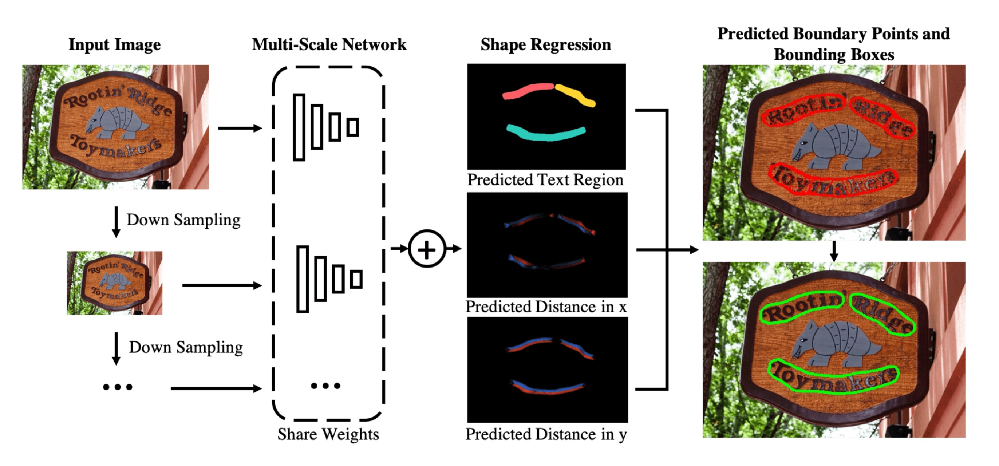

---
title: 场景文字检测中边界的艺术(下)
layout: post
date: 2019-01-18
categories: 
- paper_reading
tag: paper
blog: true
start: true
author: karl
description: Scene Text Detection
--- 

## 前言
只要边界玩的好，哪有边界检不到，边界最近快被玩坏了，今天这篇文章与advancedeast有着异曲同工之妙。

## 文章简介
最近出了一篇名字为<MSR: Multi-Scale Shape Regression for Scene Text
Detection>的文章，其大致检测过程如下：

简单来说，对于输入的一张图，首先检测其文本区域，同时对于文本区域内的没一个像素，分别预测到其最近边缘点的偏移，最终会得到如中间一列的红色轮廓，接着利用alpha-shape或者concave-hull算法可以得到最终搞得轮廓图。

### 为什么说它和[AdvancedEast](https://github.com/huoyijie/AdvancedEAST)相似呢?

为了解答这个问题，我们先简单回顾一下AdvancedEast做了些什么。我们将从标签的构造，回归的方式以及后处理方式来对比分析。

## 标签构造  

### AdvancedEAST

这里盗用一张github中的一张图来说明问题，如下图所示：

图中黄色区域表示文本的头，绿色表示文本的尾部，而红色区域表示文本区域。AdvancedEast算法在黄色区域与绿色区域分别预测到各自最近的两个角点的偏移。比如黄色区域中预测到文本上方两个点的偏移值($$\delta x$$, $$\delta y$$), 绿色区域同理。

为什么这么做呢？原因在于原始的east中的每个像素预测到四条边的距离的时候会存在以下特殊情况：

即当文本很长的时候，文本中的点预测距离值会超过网络的有效感受野的值，使得网络无法将该点与最远的边建立起关系，进而导致预测距离不准确，也就是我们常见的文本框的断裂。AdvancedEASR很聪明，直接丢弃远距离的预测，近的点就预测离它近的角点。因为我们的最终目的是预测四个点，因此就把定位点的任务分配到了文本两端。

但是这么做存在缺点，即当文本头或者尾部分割不出来的时候，便无法利用头或者尾部进行角点的定位。当然，今天分享的论文也有这种缺点，那我们就说说今天的论文中的方法。

### 论文方法
论文思路可以用下图表示：

具体来说：
- 标签构造使用shrink文本最短边的0.25最为shrink距离，然后得到文本区域
- 在对应的文本区域，分别预测是否为文本区域，以及两张map,分别存储距离其最近的边界点的偏移
- 然后再预测阶段利用score_map+geo_map得到文本的轮廓，接着利用alpha-shape或者concave-hull方法，得到外轮廓。

标签构造图如下图所示：

正如上面描述来说，可以得到对应的文本标签，但是会存在我刚才说，如果区域太小，容易无法分割得到对应的文本区域。

如上图中geo_map_deltax, 表示文本区域中的点与其最近的边界点之间的偏移，可以看出水平方向，左右两端距离左右两条边最近，因此会出现三角形区域。这部分区域很小，当文本很小的时候。因此很容易带来后面的边界定位不准的问题。这个我们后面再说。

当然，文章不仅仅是在标签上的改进。损失函数使用一下两种：
- 分割损失：dice coeffient,这种类似计算iou，对形状鲁邦
- 回归损失: smooth l1loss,标准的相对位移的回归方式。

#### 多尺度模型  

文章还对比了不同多尺度方法带来的效果不同，文章的多尺度方法：  

  

文章举了一个下采样1/2的例子，将输入图片下采样一次，然后输入至模型中，然后对相同分辨率的map进行融合。

文章对比了不同方法下的检测结果：  

上图中从左到右的顺序为，原图，多尺度的EAST，回归边界的EAST，多尺度+回归边界的EAST。可以看到多尺度和边界的结合，可以检测较为完整的区域。加入多尺度的模型，之所以可以回归完整区域，是因为利用高低层信息的融合，使得原本难以分开的区域，现在有了较强的判别性，进而像素与边缘也建立起了较强的关系。

### 讨论
讲到这里，可否这么认为，如果将该算法改为检测直文本，那么和AdvancedEAST类似，只不过不在局限于文本头和尾部，而是全局的寻找最近的点。可惜的是文章只在曲形文本、以及长文本上做了实验的对比，从侧面也可以看出该算法在ICDAR2015这类型小文字的场景不具备优势，因为小的文本区域会带来距离回归mao的丢失，导致最终的回归不准。

以下是测试结果：  

可以在长文本以及扭曲文本上取得了相当不错的性能。在复现过程中，也应证了这一点。以下是我的一些检测效果图：  

在一些商品图上的检测效果：

从上图中的检测结果可以看出，轮廓在文本的头尾出现了尖尖，这可以认为是头尾回归不好的现象。因为这部分区域的回归区域较小，因此改进这部分会给这个算法较大的提升。另外，该算法对于出现重叠的文本效果不好，因为如果一个像素属于两个文本，那么它只能回归一个文本的最近的边缘。同时这也是advancedEAST的缺点。

场景文字现在逐渐转向解决曲形文本和长文本，期间涌现了很多奇思妙想，不论是从边界到文本区域，或是文本区域到边界，都在做的一件事情是，突破感受野的限制，从局部到全局。但是这一系列的方法容易收到局部结果的影响，因此如果有一个算法兼具局部与全局，这些问题将迎刃而解。
