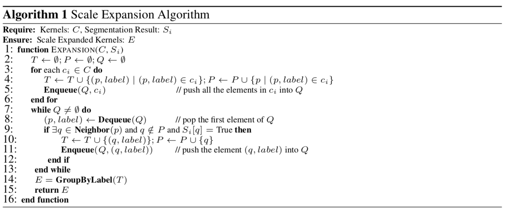

## 前言  
本文主要整理场景文字检测算法的后处理算法，主要集中讲解文字检测的后处理算法，而其他核心算法则体现在其他post里面。主要讲解以下算法：  

- seglink

- TextField

- CTPN

- EAST

- Pixelink

- PSENet

  

### Seglink后处理  
#### 网络结构  

如下图所示：  
  

VGG16权重进行转化，将fc层转换成高阶的卷积层。然后如图进行Link与segments的预测。由于不同层对应不同的感受野，因此浅层负责预测小的anchor, 深层预测大的anhcor.同时，除第一层外，其余层均预测cross-layer link，用于预测同一层中无法预测到Link。

#### 标签的处理  

标签与SSD中的处理方式类似，主要可以总结为以下两点：  
- 预测rotate的anchor
- 将完成word切分为segments

而判断是否为positive segments的条件如下面式子表示: 
$$ max(\frac{a_{l}}{h}, \frac{h}{a_{l}}) \lt 1.5$$  
表示真值框高h于anchor的比例大于一定阈值才认为两个匹配。也可以认为高度接近则认为这个anchor负责这个segment.用图来说明就是下图所示：  

  

- 简要步骤：
    - 将rbox旋转至水平
    - 然后切分与anchor w覆盖的区域
    - 再旋转回原始角度得到segments  
对于link，属于同一个文本且满足anchor的条件的的link为1，反之为0.

#### 后处理 
利用上述真值，训练得到模型之后，需要经过以下后处理得到最终的Box：


**第一步则是利用Link构建属于同一个文本的segments,用于后续的segments的合并。**
- 简要步骤：
    - 得到需要合并的segments
    - 计算平均角度作为最终合并的文本的角度
    - 利用角度得到文本线方向，利用segments的点与已知的直线斜率，得到直线的Bias(保证所有segments的点到直线的距离最近)
    - 寻找segments到直线的垂直投影点
    - 利用投影点计算得到长边的端点作为文本的长边坐标(x或者y)
    - 计算得到文本的rbox  

#### 关键点

link需要预测准确，如果link出现错误，则容易导致segments的归属预测错误，导致后续合并得到的框不完整。  

#### 图片的预处理  
- 长边缩放至指定尺寸或者直接把图缩放至指定大小, 保证图片可以整除128


### TextFiled后处理算法  

线上大致的图： 


大致的处理步骤：

首先根据网络预测得到score map, 然后通过阈值$$ \lambda $$, 得到对应的文本区域。然后根据预测得到像素向量图，对于其中每一个像素，与其八邻域构建树，一棵树表示一个文本实例。然后对每棵树进行grouping, 得到文本实例。在此之前，需要对每个文本实例进行dalited($$3x3$$)膨胀，接着得到每个文本实例。

在得到文本实例之后，我们需要对invalid的文本实例进行过滤：

- 由于方向向量应该是对称的，因此可以将方向相反的向量比率低于阈值的进行丢弃
- 同时对文本区域太小的文本实例进行丢弃，因为太小的有可能是错误的检测。

在过滤invalid文本实例之后，用大的卷积核对文本实例进行dalited,填充实例中心的空洞，然后利用CC_label得到文本实例的轮廓。以下是具体的后处理的算法：  


### CTPN后处理算法  


精髓在于：

- 水平行的搜索，确认长连接
- 构建图矩阵
- 遍历图矩阵得到文本行

### EAST后处理算法


```python
import numpy as np
from shapely.geometry import Polygon


def intersection(g, p):
    g = Polygon(g[:8].reshape((4, 2)))
    p = Polygon(p[:8].reshape((4, 2)))
    if not g.is_valid or not p.is_valid:
        return 0
    inter = Polygon(g).intersection(Polygon(p)).area
    union = g.area + p.area - inter
    if union == 0:
        return 0
    else:
        return inter/union


def weighted_merge(g, p):
    g[:8] = (g[8] * g[:8] + p[8] * p[:8])/(g[8] + p[8])
    g[8] = (g[8] + p[8])
    return g


def standard_nms(S, thres):
    order = np.argsort(S[:, 8])[::-1]
    keep = []
    while order.size > 0:
        i = order[0]
        keep.append(i)
        ovr = np.array([intersection(S[i], S[t]) for t in order[1:]])

        inds = np.where(ovr <= thres)[0]
        order = order[inds+1]

    return S[keep]


def nms_locality(polys, thres=0.3):
    '''
    locality aware nms of EAST
    :param polys: a N*9 numpy array. first 8 coordinates, then prob
    :return: boxes after nms
    '''
    S = []
    p = None
    for g in polys:
        if p is not None and intersection(g, p) > thres:
            p = weighted_merge(g, p)
        else:
            if p is not None:
                S.append(p)
            p = g
    if p is not None:
        S.append(p)

    if len(S) == 0:
        return np.array([])
    return standard_nms(np.array(S), thres)

```

主要步骤：

- 首先将每个score_map上属于文本区域的点，预测的box得到
- 判断每一个box的iou大于一定的阈值，如果超过，则进行合并；反之归为下一个文本区域
- 重复合并，最后对得到的box进行nms得到最终的检测结果。

### Pixellink后处理 


```python

def decode_image_by_join(pixel_scores, link_scores, 
                 pixel_conf_threshold, link_conf_threshold):
    pixel_mask = pixel_scores >= pixel_conf_threshold
    link_mask = link_scores >= link_conf_threshold
    points = zip(*np.where(pixel_mask))
    h, w = np.shape(pixel_mask)
    group_mask = dict.fromkeys(points, -1)
    def find_parent(point):
        return group_mask[point]
        
    def set_parent(point, parent):
        group_mask[point] = parent
        
    def is_root(point):
        return find_parent(point) == -1
    
    def find_root(point):
        root = point
        update_parent = False
        while not is_root(root):
            root = find_parent(root)
            update_parent = True
        
        # for acceleration of find_root
        if update_parent:
            set_parent(point, root)
            
        return root
        
    def join(p1, p2):
        root1 = find_root(p1)
        root2 = find_root(p2)
        
        if root1 != root2:
            set_parent(root1, root2)
        
    def get_all():
        root_map = {}
        def get_index(root):
            if root not in root_map:
                root_map[root] = len(root_map) + 1
            return root_map[root]
        
        mask = np.zeros_like(pixel_mask, dtype = np.int32)
        for point in points:
            point_root = find_root(point)
            bbox_idx = get_index(point_root)
            mask[point] = bbox_idx
        return mask
    
    # join by link
    for point in points:
        y, x = point
        neighbours = get_neighbours(x, y)
        for n_idx, (nx, ny) in enumerate(neighbours):
            if is_valid_cord(nx, ny, w, h):
#                 reversed_neighbours = get_neighbours(nx, ny)
#                 reversed_idx = reversed_neighbours.index((x, y))
                link_value = link_mask[y, x, n_idx]# and link_mask[ny, nx, reversed_idx]
                pixel_cls = pixel_mask[ny, nx]
                if link_value and pixel_cls:
                    join(point, (ny, nx))
   
    mask = get_all()
    return mask


```

核心步骤：

- 首先通过阈值过滤得到link map和score map
- 文本区域中的点，进行8邻域或者4邻域的探索：
  - 如果邻域中存在与其来自同一父节点的，则进行合并
- 最后通过cv2.minAreaRect获得最小外界矩形

后处理的方式，决定了pixellink无法很好的处理大间隔文本。而邻域的处理方式，仅仅考虑很近的文本，因此当文本间隙比较大或者包含较多背景信息导致的分割不准，会导致后续文本的区域的合并。这里其实主要依赖分割结果的好坏。解决这个问题可以从以下入手：

- 构造标签，让区域之间的像素存在较强的关联性，以保证后续后处理阶段的join；这转化为如何充分挖掘像素之间的关联性问题
- 增强网络，提升分割的性能

以上可以认为是一个点，像素之间关联性的提升会带来分割性能的提升，反过来分割性能提升，势必提升了像素之间的关联性。

### PSENet



步骤如下：

1. 进行区域合并，得到对应的联通区域，并给定对应的标记label，将其入队列
2. 出队列，得到某一个文本，然后对其周围像素进行搜索，x进行前后搜索，y进行上下搜索，如果label为文本区域，则标记为文本
3. 最后得到最终的文本区域。

代码：

```c++
void growing_text_line(vector<Mat> &kernals, vector<vector<int>> &text_line, float min_area) {
        
        Mat label_mat;
        int label_num = connectedComponents(kernals[kernals.size() - 1], label_mat, 4);

        // cout << "label num: " << label_num << endl;
        
        int area[label_num + 1];
        memset(area, 0, sizeof(area));
        for (int x = 0; x < label_mat.rows; ++x) {
            for (int y = 0; y < label_mat.cols; ++y) {
                int label = label_mat.at<int>(x, y);
                if (label == 0) continue;
                area[label] += 1;
            }
        }

        queue<Point> queue, next_queue;
        for (int x = 0; x < label_mat.rows; ++x) {
            vector<int> row(label_mat.cols);
            for (int y = 0; y < label_mat.cols; ++y) {
                int label = label_mat.at<int>(x, y);
                
                if (label == 0) continue;
                if (area[label] < min_area) continue;
                
                Point point(x, y);
                queue.push(point);
                row[y] = label;
            }
            text_line.emplace_back(row);
        }

        // cout << "ok" << endl;
        
        int dx[] = {-1, 1, 0, 0};
        int dy[] = {0, 0, -1, 1};

        for (int kernal_id = kernals.size() - 2; kernal_id >= 0; --kernal_id) {
            while (!queue.empty()) {
                Point point = queue.front(); queue.pop();
                int x = point.x;
                int y = point.y;
                int label = text_line[x][y];
                // cout << text_line.size() << ' ' << text_line[0].size() << ' ' << x << ' ' << y << endl;

                bool is_edge = true;
                for (int d = 0; d < 4; ++d) {
                    int tmp_x = x + dx[d];
                    int tmp_y = y + dy[d];

                    if (tmp_x < 0 || tmp_x >= (int)text_line.size()) continue;
                    if (tmp_y < 0 || tmp_y >= (int)text_line[1].size()) continue;
                    if (kernals[kernal_id].at<char>(tmp_x, tmp_y) == 0) continue;
                    if (text_line[tmp_x][tmp_y] > 0) continue;

                    Point point(tmp_x, tmp_y);
                    queue.push(point);
                    text_line[tmp_x][tmp_y] = label;
                    is_edge = false;
                }

                if (is_edge) {
                    next_queue.push(point);
                }
            }
            swap(queue, next_queue);
        }
    } 
```

由后处理可以看出，最后的结果依赖kernel的预测，kernel预测准确，合并过程才不会出现错误；另外与pixellink类似，基于相邻像素进行探索，如果文本存在明显的间隔或者包含背景信息较多时，容易导致分割map的不够精准，进而导致后处理无法很好的得到文本区域，进而检测失败。