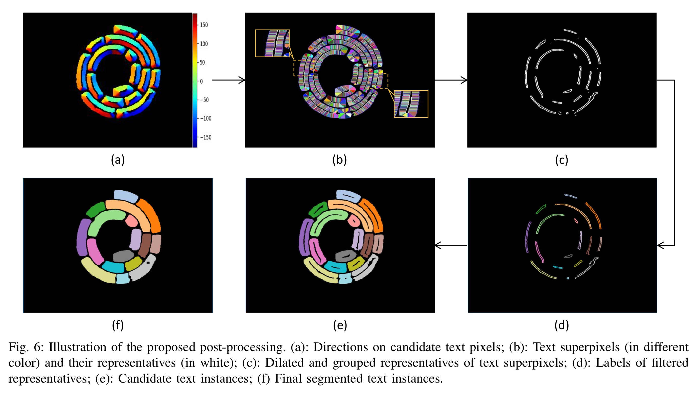
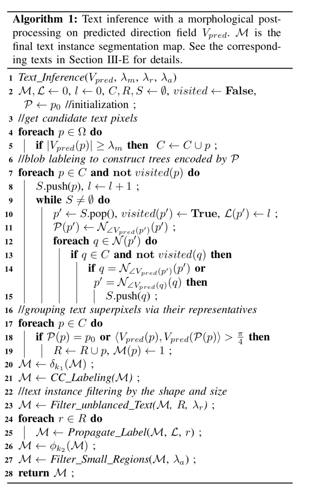
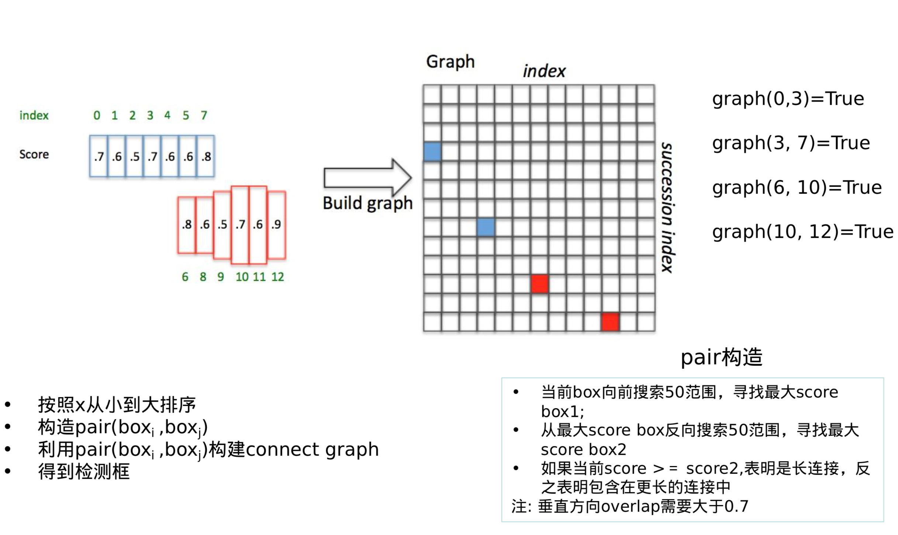

## 前言  
本文主要整理场景文字检测算法的后处理算法，主要集中讲解文字检测的后处理算法，而其他核心算法则体现在其他post里面。主要讲解以下算法：  

- seglink

- TextField

  

### Seglink后处理  
#### 网络结构  

如下图所示：  
  

VGG16权重进行转化，将fc层转换成高阶的卷积层。然后如图进行Link与segments的预测。由于不同层对应不同的感受野，因此浅层负责预测小的anchor, 深层预测大的anhcor.同时，除第一层外，其余层均预测cross-layer link，用于预测同一层中无法预测到Link。

#### 标签的处理  

标签与SSD中的处理方式类似，主要可以总结为以下两点：  
- 预测rotate的anchor
- 将完成word切分为segments

而判断是否为positive segments的条件如下面式子表示: 
$$ max(\frac{a_{l}}{h}, \frac{h}{a_{l}}) \lt 1.5$$  
表示真值框高h于anchor的比例大于一定阈值才认为两个匹配。也可以认为高度接近则认为这个anchor负责这个segment.用图来说明就是下图所示：  

  

- 简要步骤：
    - 将rbox旋转至水平
    - 然后切分与anchor w覆盖的区域
    - 再旋转回原始角度得到segments  
对于link，属于同一个文本且满足anchor的条件的的link为1，反之为0.

#### 后处理 
利用上述真值，训练得到模型之后，需要经过以下后处理得到最终的Box：


**第一步则是利用Link构建属于同一个文本的segments,用于后续的segments的合并。**
- 简要步骤：
    - 得到需要合并的segments
    - 计算平均角度作为最终合并的文本的角度
    - 利用角度得到文本线方向，利用segments的点与已知的直线斜率，得到直线的Bias(保证所有segments的点到直线的距离最近)
    - 寻找segments到直线的垂直投影点
    - 利用投影点计算得到长边的端点作为文本的长边坐标(x或者y)
    - 计算得到文本的rbox  

#### 关键点

link需要预测准确，如果link出现错误，则容易导致segments的归属预测错误，导致后续合并得到的框不完整。  

#### 图片的预处理  
- 长边缩放至指定尺寸或者直接把图缩放至指定大小, 保证图片可以整除128


### TextFiled后处理算法  

线上大致的图： 



大致的处理步骤：

首先根据网络预测得到score map, 然后通过阈值$$ \lambda $$, 得到对应的文本区域。然后根据预测得到像素向量图，对于其中每一个像素，与其八邻域构建树，一棵树表示一个文本实例。然后对每棵树进行grouping, 得到文本实例。在此之前，需要对每个文本实例进行dalited($$3x3$$)膨胀，接着得到每个文本实例。

在得到文本实例之后，我们需要对invalid的文本实例进行过滤：

- 由于方向向量应该是对称的，因此可以将方向相反的向量比率低于阈值的进行丢弃
- 同时对文本区域太小的文本实例进行丢弃，因为太小的有可能是错误的检测。

在过滤invalid文本实例之后，用大的卷积核对文本实例进行dalited,填充实例中心的空洞，然后利用CC_label得到文本实例的轮廓。以下是具体的后处理的算法：  



### CTPN后处理算法  



精髓在于：

- 水平行的搜索，确认长连接
- 构建图矩阵
- 遍历图矩阵得到文本行

### EAST后处理算法


```python
import numpy as np
from shapely.geometry import Polygon


def intersection(g, p):
    g = Polygon(g[:8].reshape((4, 2)))
    p = Polygon(p[:8].reshape((4, 2)))
    if not g.is_valid or not p.is_valid:
        return 0
    inter = Polygon(g).intersection(Polygon(p)).area
    union = g.area + p.area - inter
    if union == 0:
        return 0
    else:
        return inter/union


def weighted_merge(g, p):
    g[:8] = (g[8] * g[:8] + p[8] * p[:8])/(g[8] + p[8])
    g[8] = (g[8] + p[8])
    return g


def standard_nms(S, thres):
    order = np.argsort(S[:, 8])[::-1]
    keep = []
    while order.size > 0:
        i = order[0]
        keep.append(i)
        ovr = np.array([intersection(S[i], S[t]) for t in order[1:]])

        inds = np.where(ovr <= thres)[0]
        order = order[inds+1]

    return S[keep]


def nms_locality(polys, thres=0.3):
    '''
    locality aware nms of EAST
    :param polys: a N*9 numpy array. first 8 coordinates, then prob
    :return: boxes after nms
    '''
    S = []
    p = None
    for g in polys:
        if p is not None and intersection(g, p) > thres:
            p = weighted_merge(g, p)
        else:
            if p is not None:
                S.append(p)
            p = g
    if p is not None:
        S.append(p)

    if len(S) == 0:
        return np.array([])
    return standard_nms(np.array(S), thres)

```

主要步骤：

- 首先将每个score_map上属于文本区域的点，预测的box得到
- 判断每一个box的iou大于一定的阈值，如果超过，则进行合并；反之归为下一个文本区域
- 重复合并，最后对得到的box进行nms得到最终的检测结果。