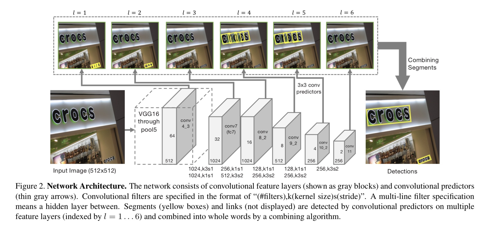
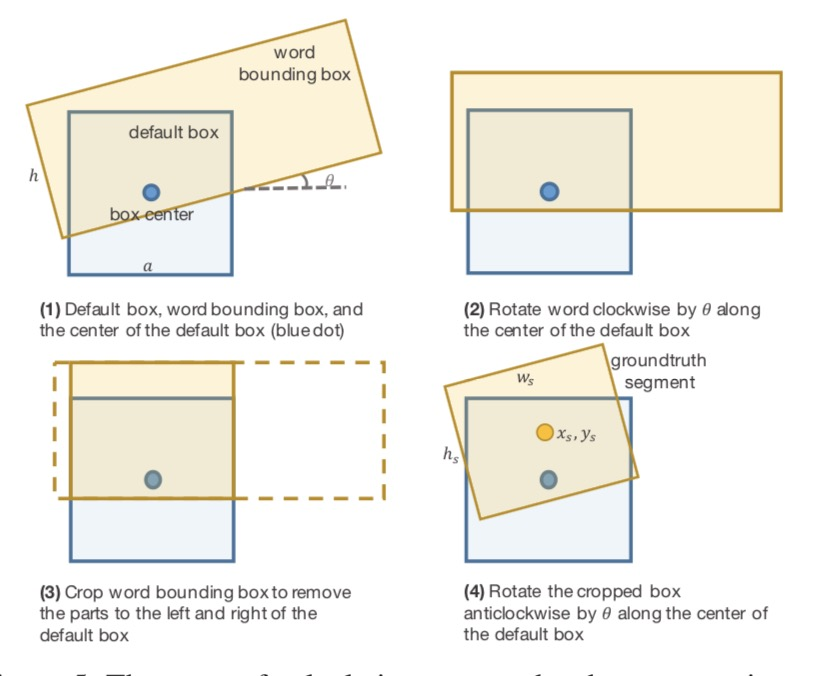
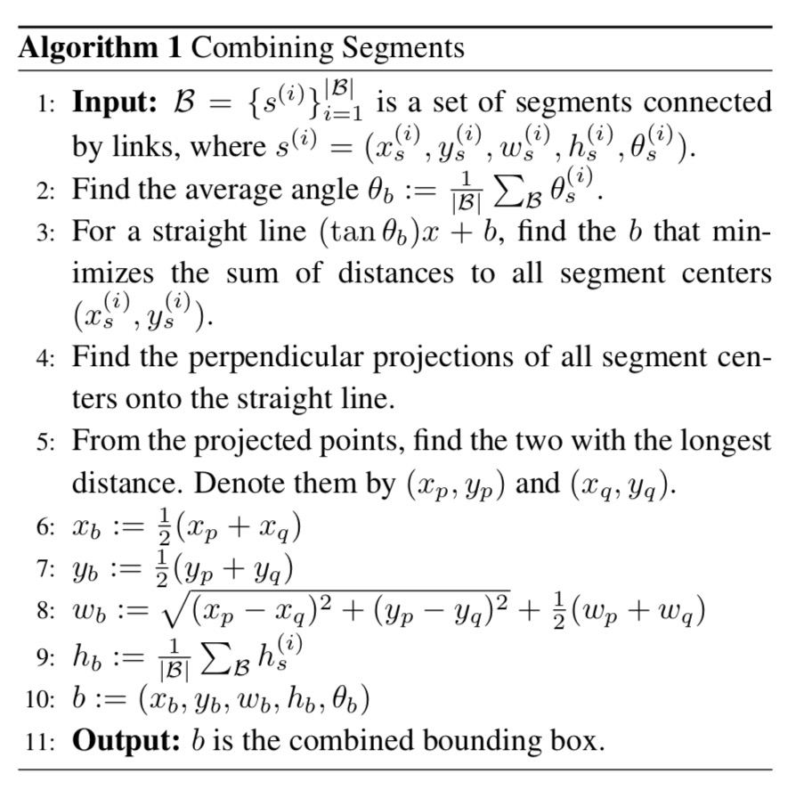

---
title: 场景文字检测算法后处理
layout: post
date: 2019-03-26
categories: 
- paper_reading
tag: paper
blog: true
start: true
author: karl
description: Scene Text Detection
--- 

## 前言  
本文主要整理场景文字检测算法的后处理算法，主要集中Seglink, R2CNN,后续陆续补充。  

### Seglink后处理  
#### 网络结构  

如下图所示：  
  

VGG16权重进行转化，将fc层转换成高阶的卷积层。然后如图进行Link与segments的预测。由于不同层对应不同的感受野，因此浅层负责预测小的anchor, 深层预测大的anhcor.同时，除第一层外，其余层均预测cross-layer link，用于预测同一层中无法预测到Link。

#### 标签的处理  

标签与SSD中的处理方式类似，主要可以总结为以下两点：  
- 预测rotate的anchor
- 将完成word切分为segments

而判断是否为positive segments的条件如下面式子表示: 
$$ max(\frac{a_{l}}{h}, \frac{h}{a_{l}}) \lt 1.5$$  
表示真值框高h于anchor的比例大于一定阈值才认为两个匹配。也可以认为高度接近则认为这个anchor负责这个segment.用图来说明就是下图所示：  

  

- 简要步骤：
    - 将rbox旋转至水平
    - 然后切分与anchor w覆盖的区域
    - 再旋转回原始角度得到segments  
对于link，属于同一个文本且满足anchor的条件的的link为1，反之为0.

#### 后处理 
利用上述真值，训练得到模型之后，需要经过以下后处理得到最终的Box：

**第一步则是利用Link构建属于同一个文本的segments,用于后续的segments的合并。**
- 简要步骤：
    - 得到需要合并的segments
    - 计算平均角度作为最终合并的文本的角度
    - 利用角度得到文本线方向，利用segments的点与已知的直线斜率，得到直线的Bias(保证所有segments的点到直线的距离最近)
    - 寻找segments到直线的垂直投影点
    - 利用投影点计算得到长边的端点作为文本的长边坐标(x或者y)
    - 计算得到文本的rbox  

#### 关键点

link需要预测准确，如果link出现错误，则容易导致segments的归属预测错误，导致后续合并得到的框不完整。  

#### 图片的预处理  
- 长边缩放至指定尺寸或者直接把图缩放至指定大小, 保证图片可以整除128

