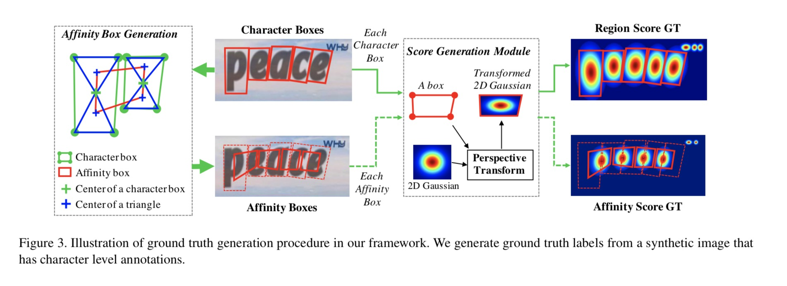
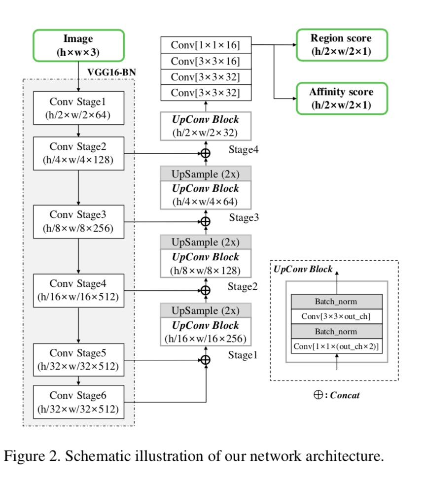
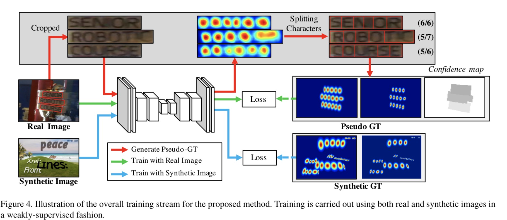
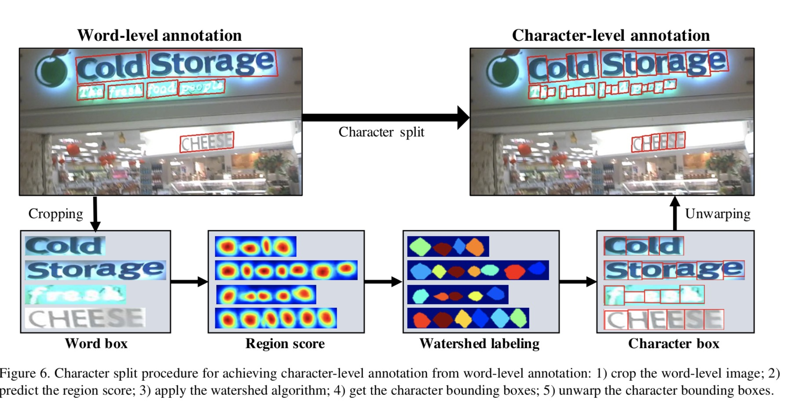

## 前言  
工作后没有大片的时间可以用来完整的写一篇博客，因此计划使用简要记录的方式对阅读的论文进行简要记录,同时以月份的形式进行记录，这样的记录方式一是可以达到快速回顾、同时可以方面后续拓展，方面后续翻看。希望自己可以坚持写下去。  

### 文字检测  

#### 1. [Character Region Awareness for Text Detection](https://www.arxiv-vanity.com/papers/1904.01941/) 
##### 核心思想

* 提出单字分割以及单字间分割的方法，类似分割版本的seglink
* 提出如何利用char level合成数据得到真实数据的char box 标注的弱监督方法

##### 标签构造

* char box以及box间的region
* 使用高斯map，为提高速度，使用一个正常的gaussian map(方的) ，计算其与char box之间的仿射变换，然后直接得到标注的gaussian map. 

##### 模型结构

* vgg_bn
* 采样至原图1/2

##### word标注生成char标注  

1. 弱监督学习过程

2. 如何得到切分好的char-box

   

##### 后处理

* 通过阈值筛选字符文本区域与字符间区域，然后通过通过阈值筛选字符文本区域与字符间区域，然后通过opencv 中连通方法得当外界轮廓

##### 数据处理

* 正常的CROP, rotated, 随机尺度变换等

##### 思考

* 方法依赖字符级别的标注
* 后处理依赖字符的分割以及字符间区域的分割。因此对于较大间隔文本的间隔无法准确分割，容易完成断裂
* 后处理依赖逐像素操作，因此速度较慢

