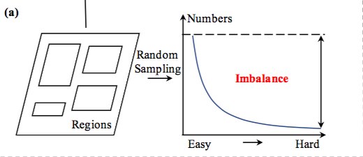
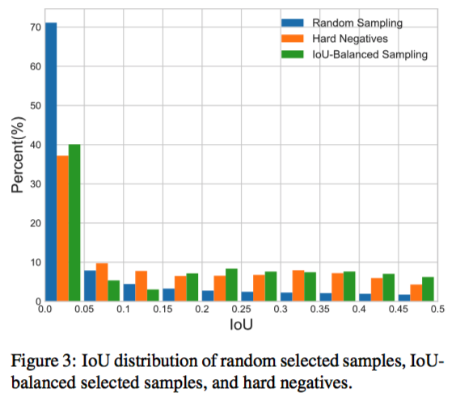
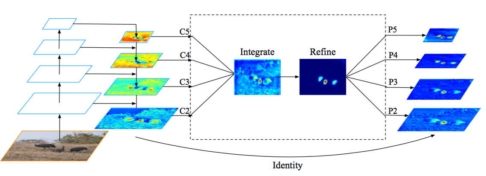
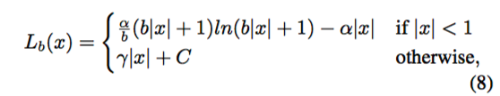
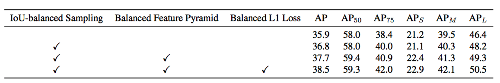

## 前言

今天分享的论文，从数据、特征、损失函数三个角度分析了目标检测中存在的样本不均衡，并针对性的加以解决。针对数据部分，提出了基于iou均衡的采样策略，针对FPN网络中的特征的不均衡，提出特征均衡的模块，针对回归部分loss存在不均衡的梯度，提出梯度均衡的损失函数。  


### 采样的艺术  

在炼丹时，对于一批数据，我们不做任何处理，直接丢进网络一把梭，最后的得到的模型虽然不是最差，但肯定不是最好的。今天分享的论文，实用性比较强，可以拓展到很多任务中。好了，先开始说一下文章做了些什么吧。  


#### 数据的均衡采样  

常见的目标检测中，对于一张图中存在的目标region，一般的做法没有考虑目标难易等的关系，而是进行随机采样。常见的步骤：

- OHEM:根据损失进行排序，取topk个样本作为我们训练的样本，其中正负样本比例为1:3
- FocalLoss:根据预测评分值动态调整样本的权重，分数越高，权重越小。



使用上述的采样方法，训练过程中，模型的梯度大部分来自容易样本，而能给模型带来提升的往往是困难样本。而且按照loss排序决定样本的难易过于粗暴，因为存在一些噪声的存在。针对这一点，文章提出了基于iou的采样策略。准确的可以用下图来描述：



图中绘制除了基于随机采样得到的样本与目标的iou分布，可以看到随机采样得到的样本大部分分布在iou为0附近，也就是大部分为负样本，正样本比例较少。这里存在较大的正负样本不均衡；同时存在iou分布的不均衡。那么如何解决此类问题呢？

在mmdetection中给出了答案，作者提出基于分桶思想的采样策略：

- iou-based
- Classes-balanced  

#### IOU-balanced  

```python
import numpy as np
import torch

from .random_sampler import RandomSampler


class IoUBalancedNegSampler(RandomSampler):
    """IoU Balanced Sampling

    arXiv: https://arxiv.org/pdf/1904.02701.pdf (CVPR 2019)

    Sampling proposals according to their IoU. `floor_fraction` of needed RoIs
    are sampled from proposals whose IoU are lower than `floor_thr` randomly.
    The others are sampled from proposals whose IoU are higher than
    `floor_thr`. These proposals are sampled from some bins evenly, which are
    split by `num_bins` via IoU evenly.

    Args:
        num (int): number of proposals.
        pos_fraction (float): fraction of positive proposals.
        floor_thr (float): threshold (minimum) IoU for IoU balanced sampling,
            set to -1 if all using IoU balanced sampling.
        floor_fraction (float): sampling fraction of proposals under floor_thr.
        num_bins (int): number of bins in IoU balanced sampling.
    """

    def __init__(self,
                 num,
                 pos_fraction,
                 floor_thr=-1,
                 floor_fraction=0,
                 num_bins=3,
                 **kwargs):
        super(IoUBalancedNegSampler, self).__init__(num, pos_fraction,
                                                    **kwargs)
        assert floor_thr >= 0 or floor_thr == -1
        assert 0 <= floor_fraction <= 1
        assert num_bins >= 1

        self.floor_thr = floor_thr
        self.floor_fraction = floor_fraction
        self.num_bins = num_bins

    def sample_via_interval(self, max_overlaps, full_set, num_expected):
        max_iou = max_overlaps.max()
        iou_interval = (max_iou - self.floor_thr) / self.num_bins
        per_num_expected = int(num_expected / self.num_bins)

        sampled_inds = []
        for i in range(self.num_bins):
            start_iou = self.floor_thr + i * iou_interval
            end_iou = self.floor_thr + (i + 1) * iou_interval
            tmp_set = set(
                np.where(
                    np.logical_and(max_overlaps >= start_iou,
                                   max_overlaps < end_iou))[0])
            tmp_inds = list(tmp_set & full_set)
            if len(tmp_inds) > per_num_expected:
                tmp_sampled_set = self.random_choice(tmp_inds,
                                                     per_num_expected)
            else:
                tmp_sampled_set = np.array(tmp_inds, dtype=np.int)
            sampled_inds.append(tmp_sampled_set)

        sampled_inds = np.concatenate(sampled_inds)
        if len(sampled_inds) < num_expected:
            num_extra = num_expected - len(sampled_inds)
            extra_inds = np.array(list(full_set - set(sampled_inds)))
            if len(extra_inds) > num_extra:
                extra_inds = self.random_choice(extra_inds, num_extra)
            sampled_inds = np.concatenate([sampled_inds, extra_inds])

        return sampled_inds

    def _sample_neg(self, assign_result, num_expected, **kwargs):
        neg_inds = torch.nonzero(assign_result.gt_inds == 0)
        if neg_inds.numel() != 0:
            neg_inds = neg_inds.squeeze(1)
        if len(neg_inds) <= num_expected:
            return neg_inds
        else:
            max_overlaps = assign_result.max_overlaps.cpu().numpy()
            # balance sampling for negative samples
            neg_set = set(neg_inds.cpu().numpy())

            if self.floor_thr > 0:
                floor_set = set(
                    np.where(
                        np.logical_and(max_overlaps >= 0,
                                       max_overlaps < self.floor_thr))[0])
                iou_sampling_set = set(
                    np.where(max_overlaps >= self.floor_thr)[0])
            elif self.floor_thr == 0:
                floor_set = set(np.where(max_overlaps == 0)[0])
                iou_sampling_set = set(
                    np.where(max_overlaps > self.floor_thr)[0])
            else:
                floor_set = set()
                iou_sampling_set = set(
                    np.where(max_overlaps > self.floor_thr)[0])

            floor_neg_inds = list(floor_set & neg_set)
            iou_sampling_neg_inds = list(iou_sampling_set & neg_set)
            num_expected_iou_sampling = int(num_expected *
                                            (1 - self.floor_fraction))
            if len(iou_sampling_neg_inds) > num_expected_iou_sampling:
                if self.num_bins >= 2:
                    iou_sampled_inds = self.sample_via_interval(
                        max_overlaps, set(iou_sampling_neg_inds),
                        num_expected_iou_sampling)
                else:
                    iou_sampled_inds = self.random_choice(
                        iou_sampling_neg_inds, num_expected_iou_sampling)
            else:
                iou_sampled_inds = np.array(
                    iou_sampling_neg_inds, dtype=np.int)
            num_expected_floor = num_expected - len(iou_sampled_inds)
            if len(floor_neg_inds) > num_expected_floor:
                sampled_floor_inds = self.random_choice(
                    floor_neg_inds, num_expected_floor)
            else:
                sampled_floor_inds = np.array(floor_neg_inds, dtype=np.int)
            sampled_inds = np.concatenate(
                (sampled_floor_inds, iou_sampled_inds))
            if len(sampled_inds) < num_expected:
                num_extra = num_expected - len(sampled_inds)
                extra_inds = np.array(list(neg_set - set(sampled_inds)))
                if len(extra_inds) > num_extra:
                    extra_inds = self.random_choice(extra_inds, num_extra)
                sampled_inds = np.concatenate((sampled_inds, extra_inds))
            sampled_inds = torch.from_numpy(sampled_inds).long().to(
                assign_result.gt_inds.device)
            return sampled_inds

```

这段代码比较长，总结思想如下：

- 将负样本分为两部分，一部分为低于阈值的样本；另外一部分是与目标存在一overlap,也就是大于阈值，但是仍为负样本的样本。
- 针对低于阈值的样本进行随机采样；对于大于阈值的样本，根据iou进行分桶，计算应该落在每个桶中的样本，最后得到iou均匀分布的负样本。

#### 类别均衡  

```python
import numpy as np
import torch

from .random_sampler import RandomSampler


class InstanceBalancedPosSampler(RandomSampler):

    def _sample_pos(self, assign_result, num_expected, **kwargs):
        pos_inds = torch.nonzero(assign_result.gt_inds > 0)
        if pos_inds.numel() != 0:
            pos_inds = pos_inds.squeeze(1)
        if pos_inds.numel() <= num_expected:
            return pos_inds
        else:
            unique_gt_inds = assign_result.gt_inds[pos_inds].unique()
            num_gts = len(unique_gt_inds)
            num_per_gt = int(round(num_expected / float(num_gts)) + 1)
            sampled_inds = []
            for i in unique_gt_inds:
                inds = torch.nonzero(assign_result.gt_inds == i.item())
                if inds.numel() != 0:
                    inds = inds.squeeze(1)
                else:
                    continue
                if len(inds) > num_per_gt:
                    inds = self.random_choice(inds, num_per_gt)
                sampled_inds.append(inds)
            sampled_inds = torch.cat(sampled_inds)
            if len(sampled_inds) < num_expected:
                num_extra = num_expected - len(sampled_inds)
                extra_inds = np.array(
                    list(set(pos_inds.cpu()) - set(sampled_inds.cpu())))
                if len(extra_inds) > num_extra:
                    extra_inds = self.random_choice(extra_inds, num_extra)
                extra_inds = torch.from_numpy(extra_inds).to(
                    assign_result.gt_inds.device).long()
                sampled_inds = torch.cat([sampled_inds, extra_inds])
            elif len(sampled_inds) > num_expected:
                sampled_inds = self.random_choice(sampled_inds, num_expected)
            return sampled_inds

```

对于类别均衡，未均衡会导致类别间的不均衡，因此需要针对一个batch中的数据进行类别均衡。如何均衡呢？类似iou部分的采样策略，计算出每个类别需要采样的个数，然后采样得到总共需要的样本数。


通过上述步骤，实现了数据部分的分类部分和回归部分的近似均衡。  

#### 特征层面的均衡  



文章认为，FPN部分的低分辨率图与高分辨率中，语义特征存在不均衡。这里的核心思想：获得不同分辨率的图是使用均衡的语义的特征。  

```python
def forward(self, inputs):
        assert len(inputs) == self.num_levels

        # step 1: gather multi-level features by resize and average
        feats = []
        gather_size = inputs[self.refine_level].size()[2:]
        for i in range(self.num_levels):
            if i < self.refine_level:
                gathered = F.adaptive_max_pool2d(
                    inputs[i], output_size=gather_size)
            else:
                gathered = F.interpolate(
                    inputs[i], size=gather_size, mode='nearest')
            feats.append(gathered)

        bsf = sum(feats) / len(feats)

        # step 2: refine gathered features
        if self.refine_type is not None:
            bsf = self.refine(bsf)

        # step 3: scatter refined features to multi-levels by a residual path
        outs = []
        for i in range(self.num_levels):
            out_size = inputs[i].size()[2:]
            if i < self.refine_level:
                residual = F.interpolate(bsf, size=out_size, mode='nearest')
            else:
                residual = F.adaptive_max_pool2d(bsf, output_size=out_size)
            outs.append(residual + inputs[i])

        return tuple(outs)

```

代码的意思即，将来自不同分辨率的map，采样至统一尺度，然后进行特征的归一化，然后再分别采样会原始分辨率。这样保证最后的到的特征来自同一融合的语义特征。  

#### 梯度的均衡  

文章认为，原始的smoothl1损失函数，在x绝对值小于1时，梯度为x的绝对值, 即针对不同大小的损失，梯度均为损失的绝对值，这样在梯度更新时，梯度会主要来自值大的部分，为了均衡这部分，文章对较大值的梯度进行压缩，让它随着值的变化不是剧烈, 可以看到，当x的绝对值大时，会比x小很多，而且比较平缓。避免因为边界点的较大梯度更新破坏模型向好的方向发展。整个损失函数如下：



同时为了保证新的损失函数梯度连续，$$\alpha ln(b+1)=\gamma$$。

#### 一些结果  



随着均衡策略的加入，AP可以看到很大的提升，通知对于大目标的定位提升较为明显。分析可以知道：

- 数据层面的均衡，可以让模型在学习过程不会学偏，尤其针对较大物体的定位，因为iou低于一定阈值的负样本，对于大物体是很多的，因此对于大目标提升较大。
- 特征层面，通过多层的聚合，特征的均衡，让不同level上的feature可以包含一致的特征。弥补之前一些level中丢失的像素，同时使得特征语义性提升
- 损失部分，梯度的均衡可以避免outlier对模型更新的破坏，让模型可以更好的学习到特征到位置的关系。大目标上达到了1.2的提升。  


### 写在后面的话

联想SNIP，数据的均衡会带来更好的特征，再加以良好的特征提取，之后就是稳定的损失函数，那么模型可以学习到很好的映射。

