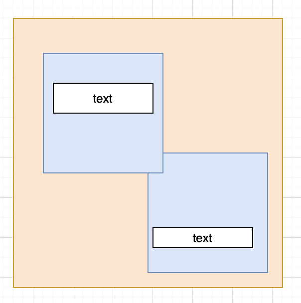
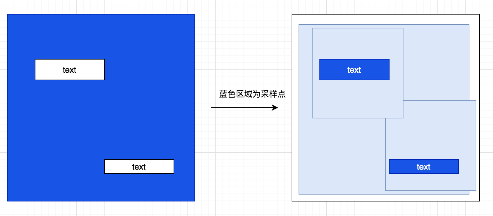
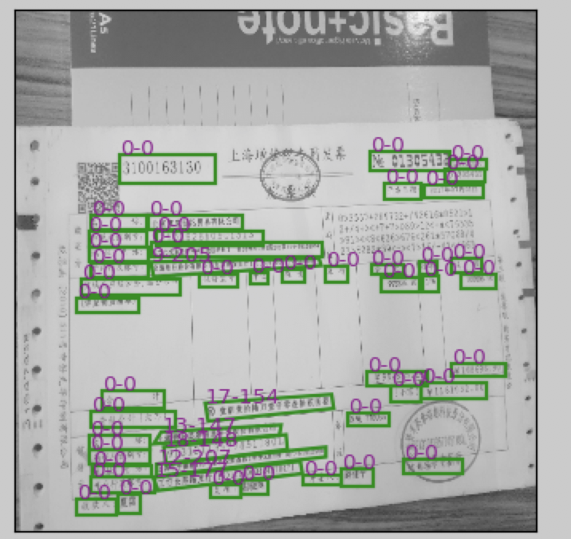
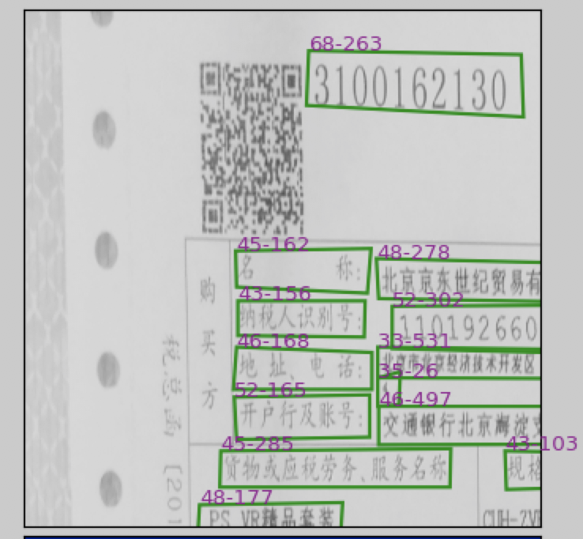

### 前言  

EAST中的图片随机裁剪，核心思想是保证每一个文本区域不被切断，即在进行随机裁剪时，保证文字区域不被切断。  


### EAST的随机裁剪方法以及改进 

我们用一张图来说明以下EAST的裁剪方法：




EAST在随机裁剪的过程中，会保证文本区域不被切断，具体的思路如下：



首先针对文本区域绘制1，其余绘制为0.接着针对蓝色区域的点进行裁剪框的采样，保证框不会超出图像区域。最后通过条件筛选，得到落在裁剪区域范围内的文本区域，同时保留完整文本区域。具体可以如下面代码所示：

```python

def crop_area(im, polys, tags, crop_background=False, max_tries=50):
    '''
    make random crop from the input image
    :param im:
    :param polys:
    :param tags:
    :param crop_background:
    :param max_tries:
    :return:
    '''
    h, w, _ = im.shape
    pad_h = h//10
    pad_w = w//10
    h_array = np.zeros((h + pad_h*2), dtype=np.int32)
    w_array = np.zeros((w + pad_w*2), dtype=np.int32)
    for poly in polys:
        poly = np.round(poly, decimals=0).astype(np.int32)
        minx = np.min(poly[:, 0])
        maxx = np.max(poly[:, 0])
        w_array[minx+pad_w:maxx+pad_w] = 1
        miny = np.min(poly[:, 1])
        maxy = np.max(poly[:, 1])
        h_array[miny+pad_h:maxy+pad_h] = 1
    # ensure the cropped area not across a text
    h_axis = np.where(h_array == 0)[0]
    w_axis = np.where(w_array == 0)[0]
    if len(h_axis) == 0 or len(w_axis) == 0:
        return im, polys, tags
    for i in range(max_tries):
        xx = np.random.choice(w_axis, size=2)
        xmin = np.min(xx) - pad_w
        xmax = np.max(xx) - pad_w
        xmin = np.clip(xmin, 0, w-1)
        xmax = np.clip(xmax, 0, w-1)
        yy = np.random.choice(h_axis, size=2)
        ymin = np.min(yy) - pad_h
        ymax = np.max(yy) - pad_h
        ymin = np.clip(ymin, 0, h-1)
        ymax = np.clip(ymax, 0, h-1)
        if xmax - xmin < FLAGS.min_crop_side_ratio*w or ymax - ymin < FLAGS.min_crop_side_ratio*h:
            # area too small
            continue
        if polys.shape[0] != 0:
            # poly_axis_in_area = (polys[:, :, 0] >= xmin) & (polys[:, :, 0] <= xmax) \
            #                     & (polys[:, :, 1] >= ymin) & (polys[:, :, 1] <= ymax)
            poly_axis_in_area = (polys[:, :, 0] >= xmin) & (polys[:, :, 0] <= xmax) \
                                & (polys[:, :, 1] >= ymin) & (polys[:, :, 1] <= ymax)
            selected_polys = np.where(np.sum(poly_axis_in_area, axis=1) >= 2)[0]
        else:
            selected_polys = []
        if len(selected_polys) == 0:
            # no text in this area
            if crop_background:
                return im[ymin:ymax+1, xmin:xmax+1, :], polys[selected_polys], tags[selected_polys]
            else:
                continue
        im = im[ymin:ymax+1, xmin:xmax+1, :]
        polys = polys[selected_polys]
        tags = tags[selected_polys]
        polys[:, :, 0] -= xmin
        polys[:, :, 1] -= ymin
        return im, polys, tags
```

然而，这样的做法针对文本区域稀疏的情况可以做到很好的裁剪，对于文本密集的情况则难以达到随机裁剪的效果。更多的情况是，保留大部分的文本，将大图进行resize。如我们常见的发票，EAST为了保留文本区域不被切断，长文本要么被忽略，要么被保留。但是当被保留是，往往需要保留整张图片。

|                       EAST随机裁剪方法                       |                            改进后                            |
| :----------------------------------------------------------: | :----------------------------------------------------------: |
|  |  |


由上图可以看到，对于密集文本且存在长行的情况，EAST的crop区域大多为图片的上半部分(因为发票中间区域为空白),为了保留长行的大部分文本区域的存在，导致达不到随机裁剪的效果。这里我们转变思路，如果我们把筛选条件放松，即文本区域可以被切断，那么在文本密集，长行较多的情况下，可以做到随机裁剪的效果。步骤如下：

- 确定要裁剪的区域

- 对落在区域内的文本区域的polys进行约束，将有两个点落在裁剪区域的文本进行保留， 当然，还可以加入对poly中心点是否在裁剪区域进行判断。

- ```python
  poly_axis_in_area = (polys[:, :, 0] >= xmin) & (polys[:, :, 0] <= xmax) \
                                  & (polys[:, :, 1] >= ymin) & (polys[:, :, 1] <= ymax)
  selected_polys = np.where(np.sum(poly_axis_in_area, axis=1) >= 2)[0]
  ```


### EAST裁剪的缺点

当文本密集且存在长行较多时，EAST的裁剪方法为了保留完整的文本区域，裁剪过程无法很好的做到随机裁剪，进而导致每次对整张图片进行resize，这样使得训练过程中的文本区域较测试过程中的文本区域尺度差异较大，同时对于长文本来说，由于resize的缘故，导致长文本的预测不准确，因为在训练过程中长文本的平均长度都比测试集中的长文本平均长度短(经过resize)。

因此需要对随机裁剪进行改进，使得在训练过程中，网络可以接收到来自图像局部的文本区域，使得密集文本不一致处于压缩状态。