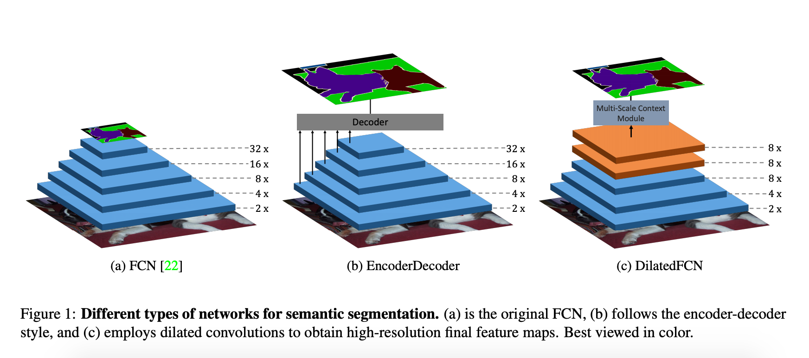
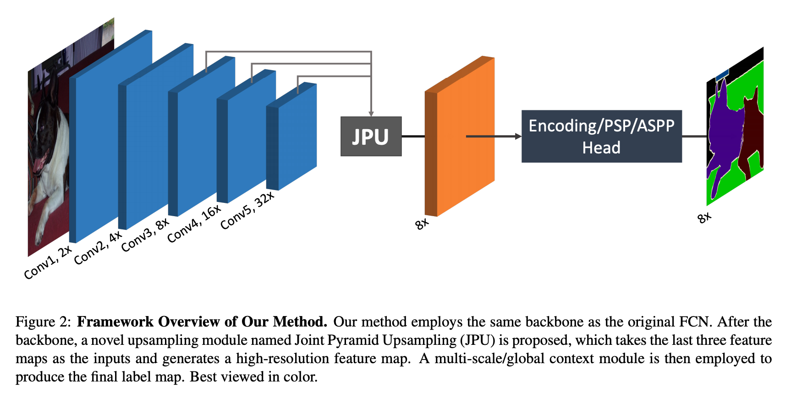
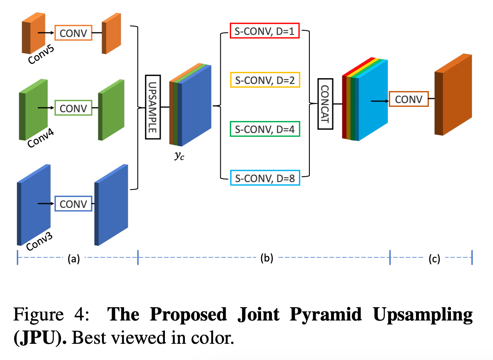
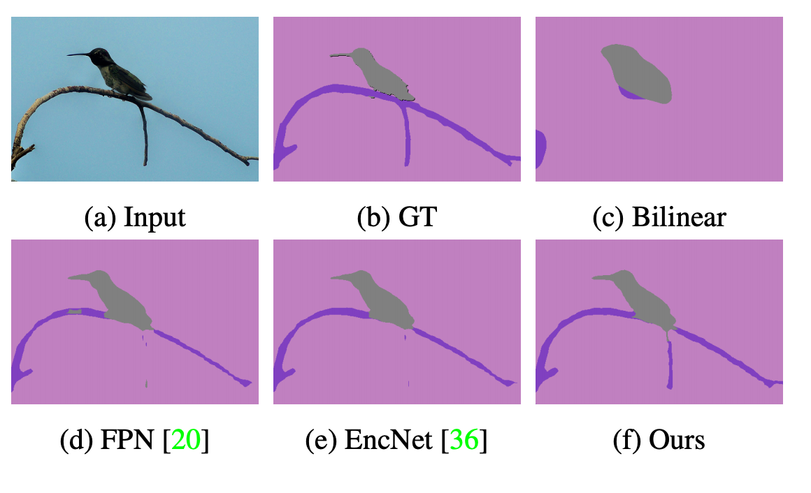
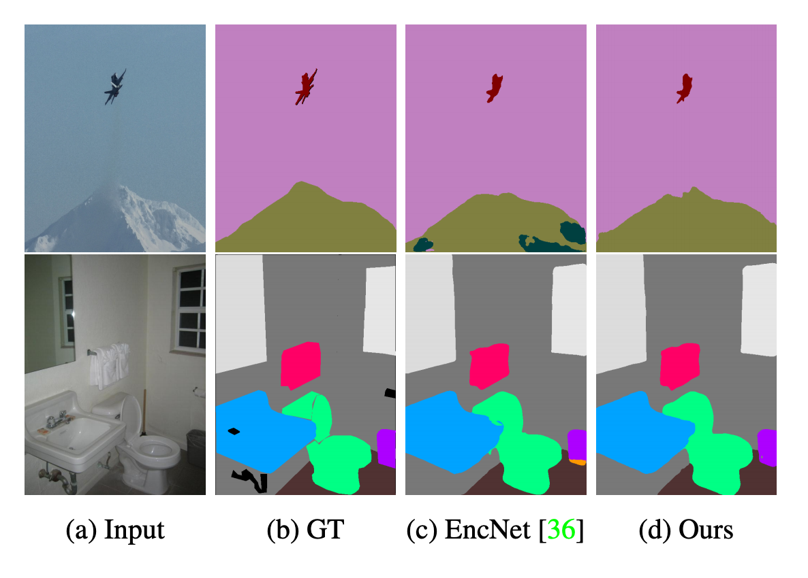
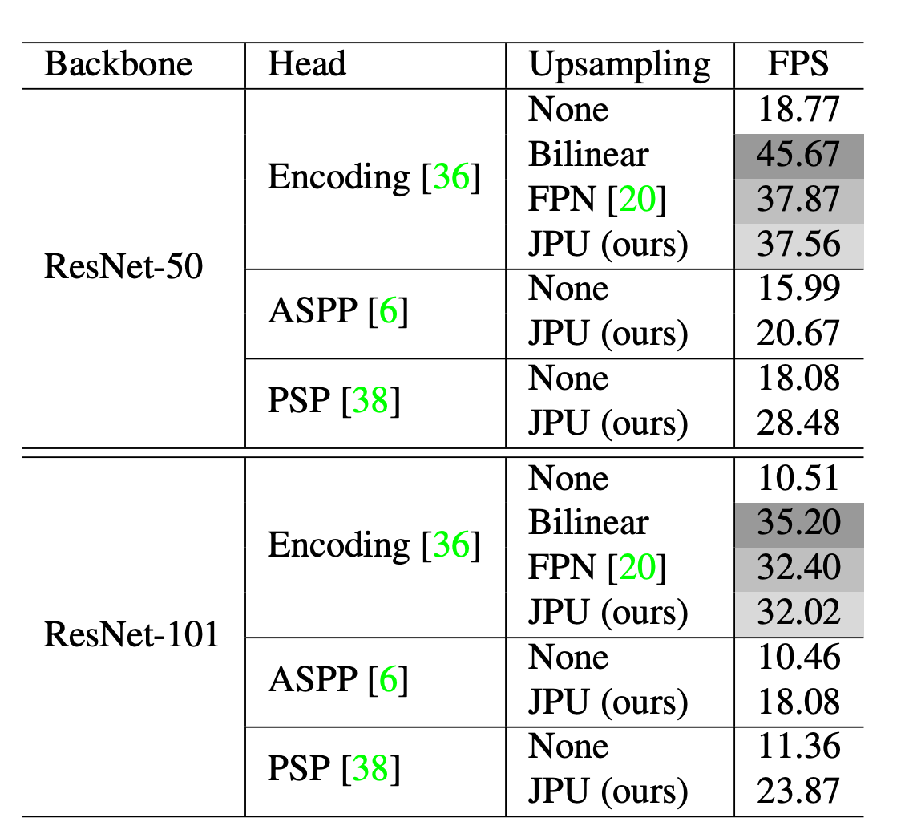
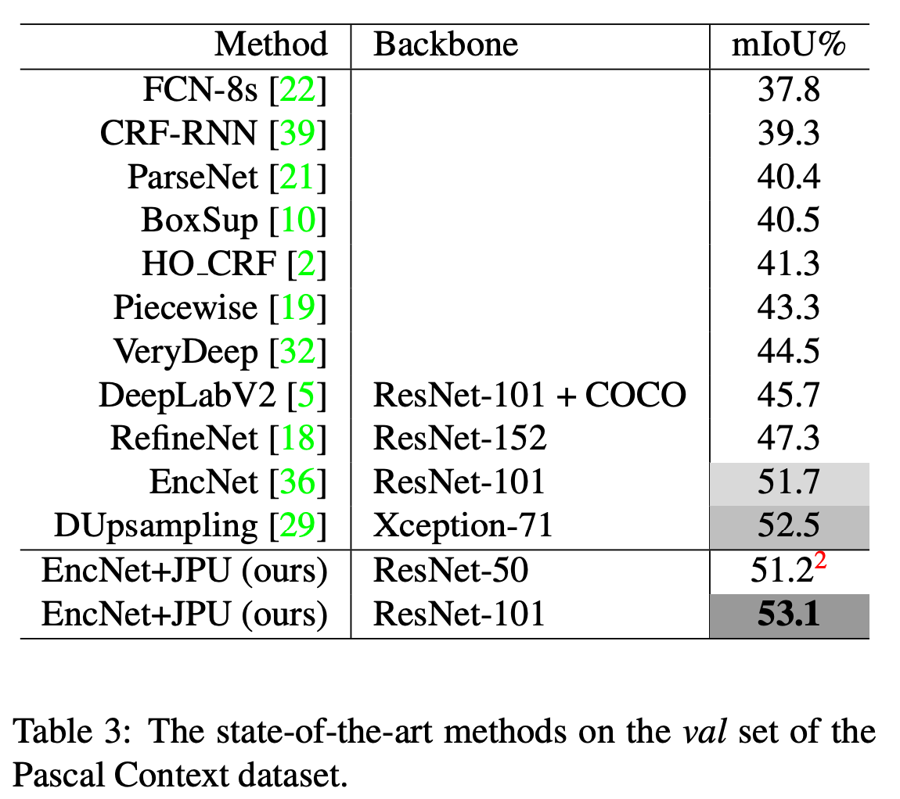

本文主要介绍FastFCN, 该方法主要改进了以往encoder-decoder的方式，将decoder改进为atrous-conv的方式，加速decoder，同时提升模型性能。  


### 核心结构  



以往的分割网络可以分为以上的前两种结构，FCN将backbone的输出结果直接采样至原图进行计算；encoder-decoder结构则利用U形结构，不断进行特征融合，逐步采样回原图。这两种结构在采样过程中由于池化，卷积等操作会带来信息的丢失。第三种叫做DilatedFCN, 典型代表为Deeplab。Deeplap系列引入atrous-conv,在保证特征分辨率的情况下，达到池化的效果。同时引入多尺度的ASPP进行不同上下文信息的获取，最终提升模型性能。然而，这样势必会带来内存的消耗以及速度的影响。而Deeplapv3+，则是在deeplabv3的基础上，加入encoder-decoder结构，逐步的特征融合，进一步提升deeplabv3的性能。然而，这类型网络由于计算量导致无法达到实时。

### FastFCN

为了解决以上问题，文章提出了新的网络结构，如下图所示：



文章提出JPU这样的结构，融合ASPP和多层尺度信息，在保证特征高分辨率的同时，达到融合特征的效果。JPU结构如下图所示：



即该结构接受来自conv3-5的特征输入，然后分别进行upsampling，最后对concat后的特征进行ASPP，再融合特征，最后输出特征。  


代码实现如下：

```python

class JPU(nn.Module):
    def __init__(self, in_channels, width=512, norm_layer=None, up_kwargs=None):
        super(JPU, self).__init__()
        self.up_kwargs = up_kwargs

        self.conv5 = nn.Sequential(
            nn.Conv2d(in_channels[-1], width, 3, padding=1, bias=False),
            norm_layer(width),
            nn.ReLU(inplace=True))
        self.conv4 = nn.Sequential(
            nn.Conv2d(in_channels[-2], width, 3, padding=1, bias=False),
            norm_layer(width),
            nn.ReLU(inplace=True))
        self.conv3 = nn.Sequential(
            nn.Conv2d(in_channels[-3], width, 3, padding=1, bias=False),
            norm_layer(width),
            nn.ReLU(inplace=True))

        self.dilation1 = nn.Sequential(SeparableConv2d(3*width, width, kernel_size=3, padding=1, dilation=1, bias=False),
                                       norm_layer(width),
                                       nn.ReLU(inplace=True))
        self.dilation2 = nn.Sequential(SeparableConv2d(3*width, width, kernel_size=3, padding=2, dilation=2, bias=False),
                                       norm_layer(width),
                                       nn.ReLU(inplace=True))
        self.dilation3 = nn.Sequential(SeparableConv2d(3*width, width, kernel_size=3, padding=4, dilation=4, bias=False),
                                       norm_layer(width),
                                       nn.ReLU(inplace=True))
        self.dilation4 = nn.Sequential(SeparableConv2d(3*width, width, kernel_size=3, padding=8, dilation=8, bias=False),
                                       norm_layer(width),
                                       nn.ReLU(inplace=True))

    def forward(self, *inputs):
        feats = [self.conv5(inputs[-1]), self.conv4(inputs[-2]), self.conv3(inputs[-3])]
        _, _, h, w = feats[-1].size()
        feats[-2] = F.upsample(feats[-2], (h, w), **self.up_kwargs)
        feats[-3] = F.upsample(feats[-3], (h, w), **self.up_kwargs)
        feat = torch.cat(feats, dim=1)
        feat = torch.cat([self.dilation1(feat), self.dilation2(feat), self.dilation3(feat), self.dilation4(feat)], dim=1)

        return inputs[0], inputs[1], inputs[2], feat
```

简单易懂，即利用多层拼接得到的不同语义、不同尺度的特征，分别进行不同尺度上下文信息的获取，接着对特征进行拼接，得到更为丰富上下文信息的特征，最后输出特征。极为丰富的上下文信息，带来很大的收益，同时减少了计算量，使得模型速度较快。  


#### 结果

|                            对比图                            |                            结果图                            |
| :----------------------------------------------------------: | :----------------------------------------------------------: |
|  |  |

#### 对比  

|                           速度对比                           |                            pascal                            |
| :----------------------------------------------------------: | :----------------------------------------------------------: |
|  |  |

### 结束语  

上下文的信息真的很重要！